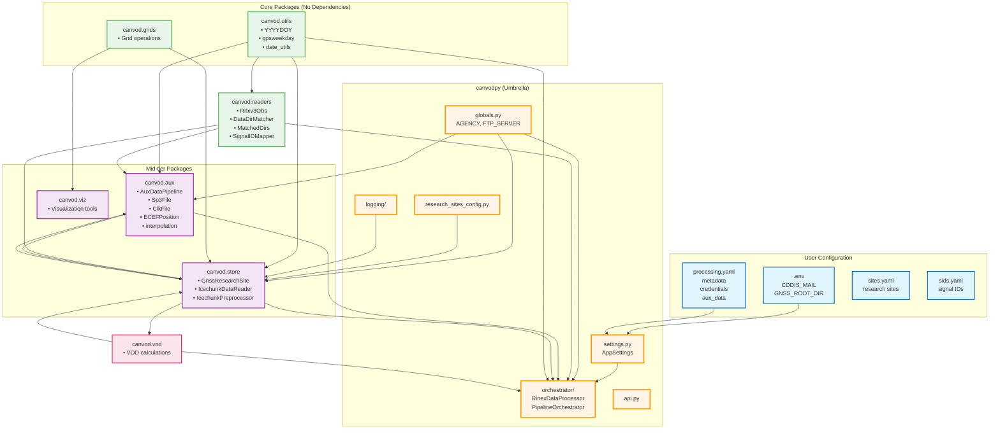

# canVODpy Package Dependency Graph

**Date:** 2026-01-25  
**Focus:** canvodpy packages and APIs (excluding external Python modules)

---

## Architecture Overview

```
┌─────────────────────────────────────────────────────────────────┐
│                    USER CONFIGURATION LAYER                      │
├─────────────────────────────────────────────────────────────────┤
│  .env                         canvodpy/config/                   │
│  ├── CDDIS_MAIL              ├── processing.yaml                │
│  └── GNSS_ROOT_DIR           ├── sites.yaml                     │
│                              └── sids.yaml                       │
└────────────────────┬────────────────────────────────────────────┘
                     │
                     ▼
┌─────────────────────────────────────────────────────────────────┐
│                    UMBRELLA PACKAGE LAYER                        │
├─────────────────────────────────────────────────────────────────┤
│                         canvodpy                                 │
│  ├── settings.py ◄── Loads .env & processing.yaml              │
│  ├── globals.py ◄─── Default constants (AGENCY, FTP_SERVER)    │
│  ├── orchestrator/ ◄ High-level orchestration                   │
│  │   ├── processor.py (RinexDataProcessor)                      │
│  │   ├── pipeline.py (PipelineOrchestrator)                     │
│  │   └── matcher.py (DatasetMatcher)                            │
│  ├── logging/                                                    │
│  ├── research_sites_config.py                                   │
│  └── api.py                                                      │
└────────────────────┬────────────────────────────────────────────┘
                     │ depends on all ↓
                     │
┌─────────────────────────────────────────────────────────────────┐
│                    NAMESPACE PACKAGE LAYER                       │
├─────────────────────────────────────────────────────────────────┤
│                                                                  │
│  ┌──────────────┐  ┌──────────────┐  ┌──────────────┐         │
│  │ canvod.utils │  │canvod.grids  │  │canvod.readers│         │
│  │              │  │              │  │              │         │
│  │ • YYYYDOY    │  │ • Grid ops   │  │ • Rnxv3Obs   │         │
│  │ • gpsweekday │  │              │  │ • DataDirMatcher      │
│  │ • date_utils │  │              │  │ • MatchedDirs │         │
│  └──────┬───────┘  └──────┬───────┘  └──────┬───────┘         │
│         │                 │                 │                  │
│         └────────┬────────┴─────────────────┤                  │
│                  │                          │                  │
│         ┌────────▼─────────┐      ┌─────────▼────────┐        │
│         │   canvod.aux     │      │   canvod.store   │        │
│         │                  │      │                  │        │
│         │ • AuxDataPipeline│◄─────┤ • GnssResearchSite       │
│         │ • Sp3File        │      │ • IcechunkDataReader     │
│         │ • ClkFile        │      │ • IcechunkPreprocessor   │
│         │ • ECEFPosition   │      │                  │        │
│         │ • interpolation  │      │                  │        │
│         └────────┬─────────┘      └─────────┬────────┘        │
│                  │                          │                  │
│                  └──────────┬───────────────┘                  │
│                             │                                  │
│                    ┌────────▼─────────┐                        │
│                    │   canvod.vod     │                        │
│                    │                  │                        │
│                    │ • VOD calculations                        │
│                    └──────────────────┘                        │
│                                                                  │
│                    ┌──────────────────┐                        │
│                    │   canvod.viz     │                        │
│                    │                  │                        │
│                    │ • Visualization  │                        │
│                    └──────────────────┘                        │
│                                                                  │
└─────────────────────────────────────────────────────────────────┘
```

---

## Detailed Dependency Graph

### Mermaid Diagram



---

## Package Dependency Matrix

| Package | Depends On |
|---------|------------|
| **canvod.utils** | *(none)* |
| **canvod.grids** | *(none)* |
| **canvod.readers** | canvod.utils |
| **canvod.aux** | canvod.readers, canvod.utils, canvod.store, canvodpy.globals, canvodpy.settings |
| **canvod.store** | canvod.grids, canvod.readers, canvod.utils, canvod.aux, canvod.vod, canvodpy.globals, canvodpy.logging, canvodpy.research_sites_config |
| **canvod.viz** | canvod.grids |
| **canvod.vod** | canvod.store |
| **canvodpy** | canvod.readers, canvod.aux, canvod.grids, canvod.store, canvod.utils, canvod.viz, canvod.vod |

---

## Package APIs & Key Modules

### 1. canvod.utils (Core Utilities)

**No Dependencies**

**Key Exports:**
```python
from canvod.utils.tools import YYYYDOY, gpsweekday
```

**Modules:**
- `tools/date_utils.py` - YYYYDOY, gpsweekday
- Other utility functions

---

### 2. canvod.grids (Grid Operations)

**No Dependencies**

**Key Exports:**
```python
from canvod.grids import ...  # Grid operations
```

---

### 3. canvod.readers (RINEX & Data Readers)

**Dependencies:** canvod.utils

**Key Exports:**
```python
from canvod.readers import (
    Rnxv3Obs,           # RINEX v3.04 observation reader
    DataDirMatcher,     # Match canopy/sky directories
    MatchedDirs,        # Matched directory container
)
from canvod.readers.gnss_specs.signals import SignalIDMapper
```

**Modules:**
- `rinex/v3_04.py` - Rnxv3Obs
- `matching/` - DataDirMatcher, MatchedDirs
- `gnss_specs/` - GNSS specifications (bands, signals, constellations)

---

### 4. canvod.aux (Auxiliary GNSS Data)

**Dependencies:** canvod.readers, canvod.utils, canvod.store, canvodpy.globals, canvodpy.settings

**Key Exports:**
```python
from canvod.aux import (
    AuxDataPipeline,    # Orchestrate aux data loading
    Sp3File,            # SP3 ephemeris file
    ClkFile,            # Clock correction file
)
from canvod.aux.position import (
    ECEFPosition,
    compute_spherical_coordinates
)
from canvod.aux.interpolation import create_interpolator_from_attrs
```

**Modules:**
- `pipeline.py` - AuxDataPipeline
- `files/sp3.py` - Sp3File
- `files/clk.py` - ClkFile
- `position.py` - ECEFPosition, spherical coordinates
- `interpolation.py` - Interpolation utilities
- `augmentation.py` - AuxDataAugmenter

**Uses:**
- `canvodpy.globals` - Default AGENCY, PRODUCT_TYPE, FTP_SERVER
- `canvodpy.settings` - CDDIS_MAIL for FTP authentication

---

### 5. canvod.store (Data Storage & Research Sites)

**Dependencies:** canvod.grids, canvod.readers, canvod.utils, canvod.aux, canvod.vod, canvodpy.globals, canvodpy.logging, canvodpy.research_sites_config

**Key Exports:**
```python
from canvod.store import (
    GnssResearchSite,       # Research site management
    IcechunkDataReader,     # Read from Icechunk store
)
from canvod.store.preprocessing import IcechunkPreprocessor
```

**Modules:**
- `research_site.py` - GnssResearchSite
- `icechunk.py` - IcechunkDataReader
- `preprocessing.py` - IcechunkPreprocessor

**Uses:**
- `canvodpy.research_sites_config` - Site definitions
- `canvodpy.logging` - Logging configuration

---

### 6. canvod.viz (Visualization)

**Dependencies:** canvod.grids

**Key Exports:**
```python
from canvod.viz import ...  # Visualization tools
```

---

### 7. canvod.vod (VOD Calculations)

**Dependencies:** canvod.store

**Key Exports:**
```python
from canvod.vod import ...  # VOD calculation functions
```

---

### 8. canvodpy (Umbrella Package)

**Dependencies:** All namespace packages

**Key Exports:**
```python
# Orchestrator
from canvodpy.orchestrator import (
    RinexDataProcessor,
    PipelineOrchestrator,
    SingleReceiverProcessor
)

# Settings
from canvodpy.settings import get_settings, AppSettings

# Globals
from canvodpy.globals import (
    AGENCY,
    PRODUCT_TYPE,
    FTP_SERVER,
    SP3_FILE_PATH,
    CLK_FILE_PATH
)
```

**Modules:**
- `orchestrator/processor.py` - RinexDataProcessor
- `orchestrator/pipeline.py` - PipelineOrchestrator
- `orchestrator/matcher.py` - DatasetMatcher
- `settings.py` - Settings management
- `globals.py` - Global constants
- `logging/` - Logging utilities
- `research_sites_config.py` - Research site configurations
- `api.py` - High-level API

---

## Configuration System

### User Configuration Files

#### 1. `.env` (Environment Variables)

```bash
# Optional: Enable NASA CDDIS fallback
CDDIS_MAIL=your.email@example.com

# Optional: Override default data directory
GNSS_ROOT_DIR=/path/to/your/data
```

**Location:** Project root  
**Loaded by:** `canvodpy.settings.AppSettings`

---

#### 2. `canvodpy/config/processing.yaml`

```yaml
metadata:
  author: Your Name
  email: your.email@example.com
  institution: Your Institution

credentials:
  cddis_mail: your.email@example.com  # or null
  gnss_root_dir: /path/to/your/gnss/data

aux_data:
  agency: COD              # COD, GFZ, IGS, ESA, etc.
  product_type: final      # final, rapid, ultra-rapid
```

**Location:** `canvodpy/config/`  
**Used by:** `canvodpy.settings`, `canvod.aux.pipeline`

---

#### 3. `canvodpy/config/sites.yaml`

Research site definitions.

**Used by:** `canvodpy.research_sites_config`, `canvod.store`

---

#### 4. `canvodpy/config/sids.yaml`

Signal ID configurations.

**Used by:** Signal processing components

---

## Dependency Flow

### Configuration → Settings → Packages

```
.env + processing.yaml
        ↓
    settings.py (AppSettings)
        ↓
    ┌───────────────────┐
    │                   │
    ▼                   ▼
aux.pipeline      orchestrator
    ↓
Uses CDDIS_MAIL for FTP auth
Uses GNSS_ROOT_DIR for data path
```

### Globals → Packages

```
globals.py
    ↓
    ├→ aux.pipeline (AGENCY, FTP_SERVER defaults)
    ├→ store (default paths)
    └→ orchestrator (processing defaults)
```

### Package Import Flow

```
Core Layer (No Dependencies):
    canvod.utils
    canvod.grids

Base Layer:
    canvod.readers ← canvod.utils

Mid Layer:
    canvod.aux ← canvod.readers, canvod.utils, canvodpy.globals, canvodpy.settings
    canvod.store ← canvod.grids, canvod.readers, canvod.utils, canvodpy.*
    canvod.viz ← canvod.grids

Processing Layer:
    canvod.vod ← canvod.store
    (Note: canvod.aux ↔ canvod.store have circular imports via optional imports)

Orchestration Layer:
    canvodpy ← all packages
```

---

## Circular Dependencies

### Identified Circular Imports

**canvod.aux ↔ canvod.store**

**Resolution:** Optional imports - canvod.aux imports canvod.store components only when needed (lazy imports)

**Example:**
```python
# In canvod.aux.pipeline
def some_method(self):
    from canvod.store.preprocessing import IcechunkPreprocessor  # Lazy import
    preprocessor = IcechunkPreprocessor(...)
```

---

## Key Design Principles

### 1. Namespace Packaging
- 7 independent packages under `canvod.*` namespace
- No `__init__.py` in namespace roots
- Full independence - packages can be extracted to separate repos

### 2. Umbrella Package
- `canvodpy` provides high-level orchestration
- Depends on all namespace packages
- Provides settings & globals infrastructure

### 3. Configuration Hierarchy
```
User Config (.env, *.yaml)
    ↓
Settings Module (canvodpy.settings)
    ↓
Globals Module (canvodpy.globals)
    ↓
Package Defaults
```

### 4. Dependency Layers
```
Layer 0: utils, grids (no deps)
Layer 1: readers (→ utils)
Layer 2: aux, store, viz (→ Layer 0/1)
Layer 3: vod (→ Layer 2)
Layer 4: canvodpy (→ all)
```

---

## Import Examples

### Using Configuration

```python
from canvodpy.settings import get_settings
from canvodpy.globals import AGENCY, FTP_SERVER

# Get runtime settings
settings = get_settings()
email = settings.get_user_email()  # From .env or processing.yaml
root = settings.gnss_root_path

# Use global defaults
print(f"Default agency: {AGENCY}")
print(f"FTP server: {FTP_SERVER}")
```

### Using Packages Together

```python
# High-level orchestration
from canvodpy.orchestrator import RinexDataProcessor

processor = RinexDataProcessor(rinex_file="data.25o")
processor.process()

# Low-level components
from canvod.readers import Rnxv3Obs, MatchedDirs
from canvod.aux import AuxDataPipeline
from canvod.utils.tools import YYYYDOY

md = MatchedDirs(
    canopy_data_dir="path/canopy/25001",
    sky_data_dir="path/sky/25001",
    yyyydoy=YYYYDOY.from_str("2025001")
)

pipeline = AuxDataPipeline.create_standard(matched_dirs=md)
pipeline.load_all()
```

---

## Package Extraction

Each namespace package is designed for independent extraction:

```bash
# Extract canvod-readers to separate repo
packages/canvod-readers/
├── pyproject.toml          # Self-contained config
├── src/canvod/readers/     # Complete implementation
├── tests/                  # Package tests
└── docs/                   # Package docs

# Only dependency: canvod-utils
# Can be published independently to PyPI
```

---

**Summary:** The architecture follows a layered approach with clear separation of concerns. Configuration flows from user files → settings → globals → packages. The umbrella package orchestrates high-level workflows while namespace packages provide modular, extractable functionality.
