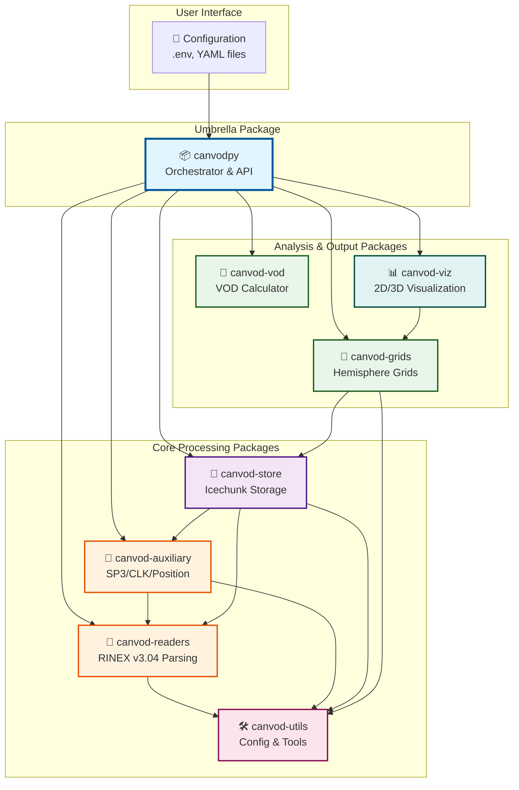
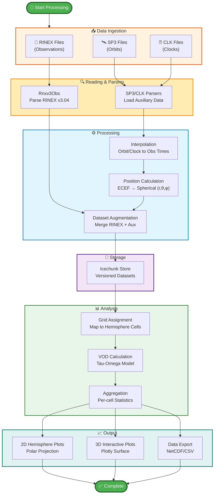
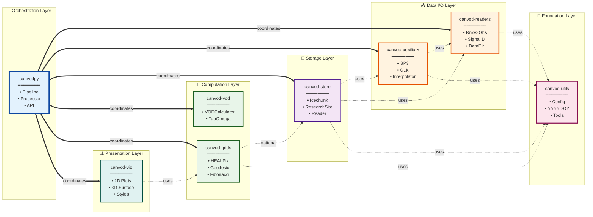
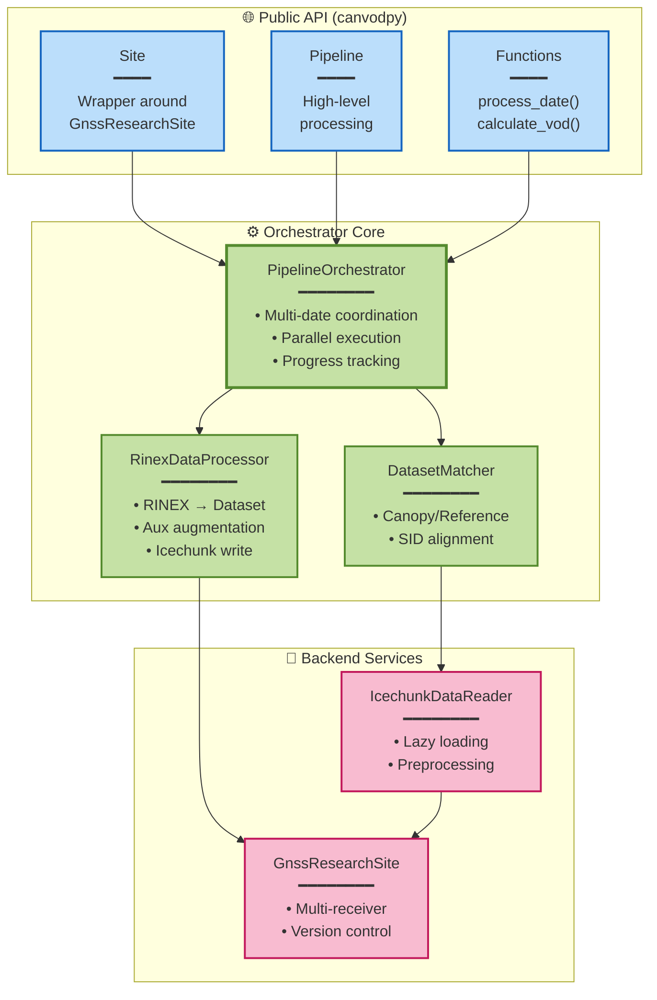
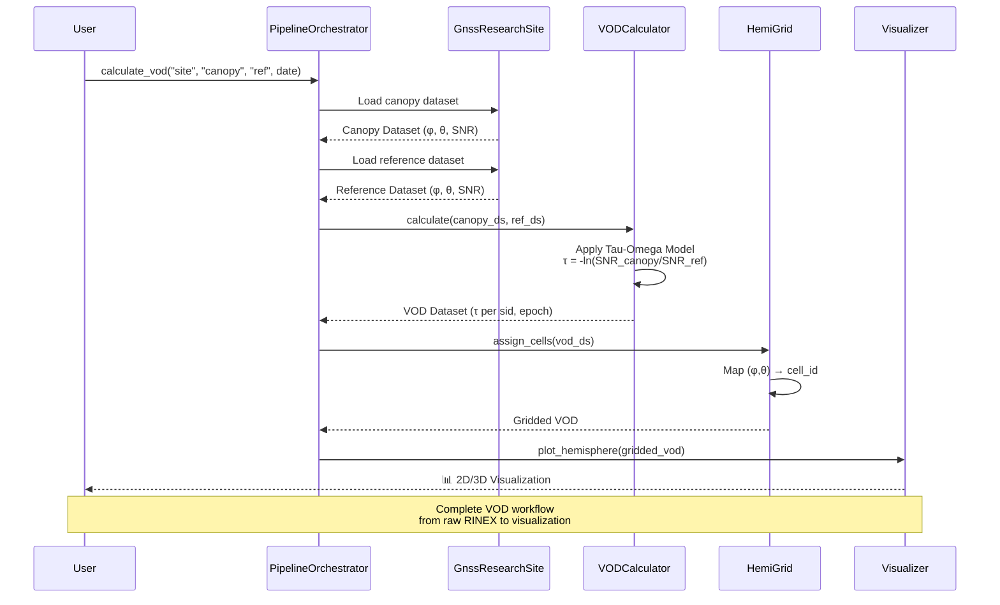
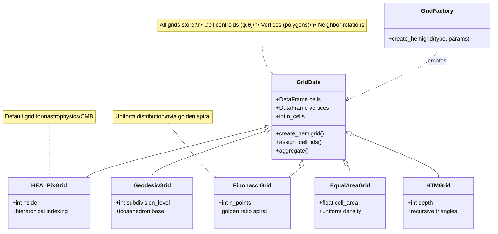
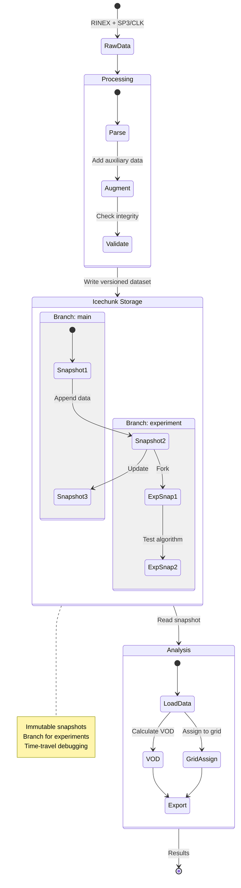
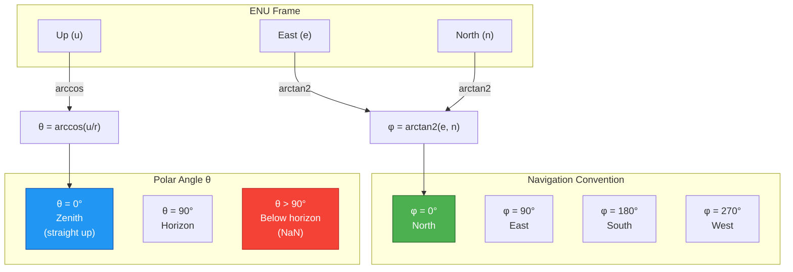

# CANVODPY Architecture Diagrams

> **Beautiful Mermaid diagrams for the CANVODPY GNSS VOD processing pipeline**

This document provides comprehensive visual architecture documentation using Mermaid diagrams.
View with [beautiful-mermaid](https://github.com/lukilabs/beautiful-mermaid) or [Mermaid Live Editor](https://mermaid.live).

---

## 📦 Package Structure Overview



---

## 🔄 Data Processing Pipeline



---

## 🏗️ Package Dependencies (Detailed)



---

## 🎯 Orchestrator Component Architecture



---

## 🔬 VOD Calculation Workflow



---

## 📊 Grid System Architecture



---

## 🔐 Storage & Versioning



---

## 🚀 Performance Optimization Targets

```mermaid
mindmap
  root((Performance<br/>Optimization))
    I/O Operations
      Metadata Writes
        **CRITICAL**
        Batch writes
        100+ files
        Save 20-30s
      RINEX Validation
        Parallel validation
        Fast pre-checks
        Cache results
        Save 5-15s
    Memory Management
      Dataset Copying
        Avoid .copy()
        Selective attrs
        50-200ms/file
      .values Calls
        Use vectorized ops
        Lazy evaluation
        5-10% memory
    Parallelization
      Nested ThreadPools
        **LOW PRIORITY**
        Once per 24h
        Minimal impact
```

---

## 📐 Spherical Coordinate System



---

## 📝 Key Architectural Principles

1. **🔹 Namespace Package Pattern**: All packages use `canvod.*` namespace for clean separation
2. **🔹 Lazy Imports**: Umbrella package uses `__getattr__` to avoid circular dependencies
3. **🔹 Independent Packages**: Each `canvod-*` can be used standalone
4. **🔹 Configuration-Driven**: YAML configs and `.env` for reproducibility
5. **🔹 Versioned Storage**: Icechunk enables time-travel debugging
6. **🔹 Parallel-Ready**: PipelineOrchestrator supports configurable workers
7. **🔹 Type-Safe**: Modern Python with type hints throughout

---

## 🎨 Viewing These Diagrams

For best results, view these diagrams using:
- **[beautiful-mermaid](https://github.com/lukilabs/beautiful-mermaid)** - Beautiful rendering ⭐
- **[Mermaid Live Editor](https://mermaid.live)** - Interactive editing
- **GitHub** - Native Mermaid support in Markdown
- **VS Code** - Mermaid preview extensions

---

*Generated: 2026-02-02 | CANVODPY Architecture Documentation v1.0*
