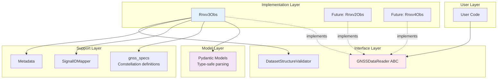
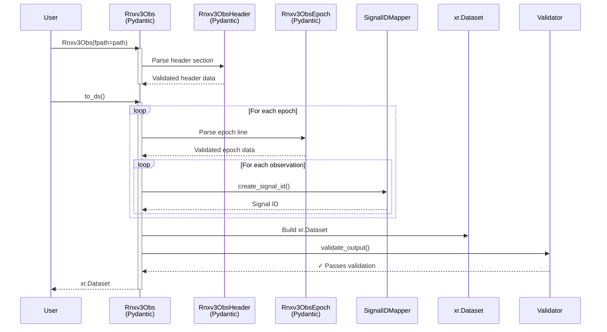

# Architecture & Design

This page explains the architectural principles behind canvod-readers, focusing on the Abstract Base Class (ABC) pattern that makes the package extensible and maintainable.

## The Abstract Base Class Pattern

### Why ABC?

The ABC pattern provides several critical benefits:

1. **Contract Enforcement**: All readers must implement required methods
2. **Type Safety**: Static type checkers can verify implementations
3. **Maintainability**: Changes to the interface are explicit
4. **Testing**: Mock implementations for testing downstream code
5. **Documentation**: The ABC serves as living documentation

### The `GNSSDataReader` ABC

Located in `canvod/readers/base.py`, this is the foundation of all readers:

```python
from abc import ABC, abstractmethod
from pathlib import Path
import xarray as xr

class GNSSDataReader(ABC):
    """Abstract base for all GNSS data format readers.

    All readers must:
    1. Inherit from this class
    2. Implement all abstract methods
    3. Return xarray.Dataset that passes DatasetStructureValidator
    4. Provide file hash for deduplication
    """

    fpath: Path  # Provided by Pydantic BaseModel in concrete classes

    @property
    @abstractmethod
    def file_hash(self) -> str:
        """SHA256 hash of file for deduplication."""
        pass

    @abstractmethod
    def to_ds(
        self,
        keep_rnx_data_vars: list[str] | None = None,
        **kwargs
    ) -> xr.Dataset:
        """Convert data to xarray.Dataset."""
        pass

    @abstractmethod
    def iter_epochs(self):
        """Iterate over epochs in file."""
        pass

    @property
    @abstractmethod
    def start_time(self) -> datetime:
        """Start time of observations."""
        pass

    @property
    @abstractmethod
    def end_time(self) -> datetime:
        """End time of observations."""
        pass

    @property
    @abstractmethod
    def systems(self) -> list[str]:
        """GNSS systems in file."""
        pass

    @property
    @abstractmethod
    def num_epochs(self) -> int:
        """Number of epochs."""
        pass

    @property
    @abstractmethod
    def num_satellites(self) -> int:
        """Number of unique satellites."""
        pass

    def validate_output(
        self,
        dataset: xr.Dataset,
        required_vars: list[str] | None = None
    ) -> None:
        """Validate Dataset structure."""
        validator = DatasetStructureValidator(dataset=dataset)
        validator.validate_all(required_vars=required_vars)
```

### Contract Guarantees

When you implement `GNSSDataReader`, you **guarantee**:

1. **File Access**: `fpath` attribute contains Path to data file
2. **Hash Computation**: `file_hash` returns deterministic identifier
3. **Dataset Conversion**: `to_ds()` returns validated xarray.Dataset
4. **Iteration**: `iter_epochs()` yields epoch-by-epoch data
5. **Metadata**: Properties provide time range, systems, counts
6. **Validation**: Output passes `DatasetStructureValidator`

## Layered Architecture



### Layer Responsibilities

**1. User Layer**
- Instantiates readers
- Calls `to_ds()`, `iter_epochs()`
- Works with returned Datasets

**2. Interface Layer (ABC)**
- Defines required methods
- Enforces contracts
- Validates output structure

**3. Implementation Layer (Concrete Readers)**
- Parse specific formats
- Implement abstract methods
- Handle format-specific details

**4. Support Layer**
- Constellation specifications (GPS, Galileo, etc.)
- Signal ID mapping
- Metadata templates

**5. Model Layer (Pydantic)**
- Type-safe data models
- Automatic validation
- Parse RINEX structure

## Component Interactions

### Parsing Flow



### Key Interactions:

1. **Pydantic Models**: Parse and validate raw text
2. **SignalIDMapper**: Convert observation codes to Signal IDs
3. **Dataset Builder**: Construct xarray structure
4. **Validator**: Ensure output meets requirements

## Design Principles

### 1. Fail Fast with Pydantic

**Problem**: Errors discovered during analysis are expensive

**Solution**: Validate during parsing with Pydantic

```python
from pydantic import BaseModel, field_validator

class Rnxv3ObsHeader(BaseModel):
    """RINEX v3 header with automatic validation."""

    rinex_version: float
    rinex_type: str

    @field_validator('rinex_version')
    def check_version(cls, v):
        if not (3.0 <= v < 4.0):
            raise ValueError(f"Expected RINEX v3, got {v}")
        return v

    @field_validator('rinex_type')
    def check_type(cls, v):
        if v != 'O':
            raise ValueError(f"Expected observation file, got {v}")
        return v
```

**Benefits**:
- Errors caught at parse time, not analysis time
- Clear, structured error messages
- Type safety throughout codebase

### 2. Immutability

Once created, readers and their outputs are immutable:

```python
class Rnxv3Obs(BaseModel):
    """Immutable after initialization."""

    model_config = ConfigDict(frozen=True)
    fpath: Path

    # Attempting to modify raises error
    # reader.fpath = new_path  # ❌ FrozenInstanceError
```

**Benefits**:
- Predictable behavior
- Thread-safe
- Cacheable results

### 3. Separation of Format and Processing

**Format-specific** code stays in the reader:
```python
# In Rnxv3Obs
def _parse_epoch_line(self, line: str) -> Rnxv3ObsEpochRecord:
    """RINEX v3 specific parsing."""
    ...
```

**Generic** processing moves to helpers:
```python
# In gnss_specs
def create_signal_id(sv: str, obs_code: str) -> str:
    """Works for any format."""
    ...
```

### 4. Explicit Over Implicit

Configuration is always explicit:

```python
# ✅ Good: Explicit parameter
ds = reader.to_ds(keep_rnx_data_vars=["SNR", "Phase"])

# ❌ Bad: Hidden default behavior
ds = reader.to_ds()  # What variables are included?
```

### 5. Validation as Requirement

Every Dataset **must** be validated:

```python
def to_ds(self, **kwargs) -> xr.Dataset:
    """Convert to Dataset."""
    ds = self._build_dataset(**kwargs)

    # Validation is mandatory, not optional
    self.validate_output(ds)

    return ds
```

## DatasetStructureValidator

The validator ensures all readers produce compatible output:

```python
class DatasetStructureValidator(BaseModel):
    """Validates xarray.Dataset structure."""

    dataset: xr.Dataset

    def validate_dimensions(self) -> None:
        """Check (epoch, sid) dimensions exist."""
        required = {"epoch", "sid"}
        missing = required - set(self.dataset.dims)
        if missing:
            raise ValueError(f"Missing dimensions: {missing}")

    def validate_coordinates(self) -> None:
        """Check all required coordinates with correct dtypes."""
        required_coords = {
            "epoch": "datetime64[ns]",
            "sid": "object",
            "sv": "object",
            "system": "object",
            "band": "object",
            "code": "object",
            "freq_center": "float64",
            "freq_min": "float64",
            "freq_max": "float64",
        }

        for coord, expected_dtype in required_coords.items():
            if coord not in self.dataset.coords:
                raise ValueError(f"Missing coordinate: {coord}")

            actual_dtype = str(self.dataset[coord].dtype)
            if expected_dtype not in actual_dtype:
                raise ValueError(
                    f"Wrong dtype for {coord}: "
                    f"expected {expected_dtype}, got {actual_dtype}"
                )

    def validate_data_variables(
        self, required_vars: list[str] | None = None
    ) -> None:
        """Check required data variables exist with correct structure."""
        if required_vars is None:
            required_vars = ["SNR", "Phase"]

        missing = set(required_vars) - set(self.dataset.data_vars)
        if missing:
            raise ValueError(f"Missing variables: {missing}")

        # All variables must be (epoch, sid)
        for var in self.dataset.data_vars:
            if self.dataset[var].dims != ("epoch", "sid"):
                raise ValueError(
                    f"{var} has wrong dimensions: "
                    f"expected (epoch, sid), got {self.dataset[var].dims}"
                )

    def validate_attributes(self) -> None:
        """Check required global attributes for storage."""
        required = {
            "Created",
            "Software",
            "Institution",
            "RINEX File Hash",  # For MyIcechunkStore deduplication
        }

        missing = required - set(self.dataset.attrs.keys())
        if missing:
            raise ValueError(f"Missing attributes: {missing}")
```

### Why These Requirements?

**Dimensions (epoch, sid)**:
- Standardizes time series structure
- Enables efficient indexing and slicing
- Compatible with xarray operations

**Coordinates**:
- `freq_*`: Required for band overlap detection
- `system`, `band`, `code`: Enable filtering
- `sv`: Track individual satellites

**Attributes**:
- `"RINEX File Hash"`: Prevents duplicate ingestion in storage
- Metadata: Provenance and reproducibility

## ReaderFactory Pattern

For automatic format detection:

```python
class ReaderFactory:
    """Factory for creating appropriate reader."""

    _readers: dict[str, type] = {}

    @classmethod
    def register(cls, format_name: str, reader_class: type) -> None:
        """Register a reader for a format."""
        if not issubclass(reader_class, GNSSDataReader):
            raise TypeError(f"{reader_class} must inherit GNSSDataReader")
        cls._readers[format_name] = reader_class

    @classmethod
    def create(cls, fpath: Path, **kwargs) -> GNSSDataReader:
        """Create appropriate reader for file."""
        format_name = cls._detect_format(fpath)

        if format_name not in cls._readers:
            raise ValueError(f"No reader for format: {format_name}")

        reader_class = cls._readers[format_name]
        return reader_class(fpath=fpath, **kwargs)

    @staticmethod
    def _detect_format(fpath: Path) -> str:
        """Detect format from file content."""
        with open(fpath, 'r') as f:
            first_line = f.readline()

        # RINEX version in columns 1-9
        version_str = first_line[:9].strip()
        version = float(version_str)

        if 3.0 <= version < 4.0:
            return 'rinex_v3'
        elif 2.0 <= version < 3.0:
            return 'rinex_v2'
        else:
            raise ValueError(f"Unsupported RINEX version: {version}")
```

**Usage**:

```python
# Register readers
ReaderFactory.register('rinex_v3', Rnxv3Obs)
ReaderFactory.register('rinex_v2', Rnxv2Obs)  # When implemented

# Automatic detection
reader = ReaderFactory.create("unknown_file.rnx")
# Returns Rnxv3Obs or Rnxv2Obs based on content
```

## Summary

The architecture of canvod-readers provides:

1. **Strong Contracts**: ABC ensures all readers behave consistently
2. **Type Safety**: Pydantic catches errors during parsing
3. **Validation**: DatasetStructureValidator ensures compatibility
4. **Extensibility**: New formats implement ABC without modifying existing code
5. **Maintainability**: Clear separation of concerns

Next, let's dive into the [RINEX v3.04 Reader implementation](rinex_reader.md) to see these principles in action.
