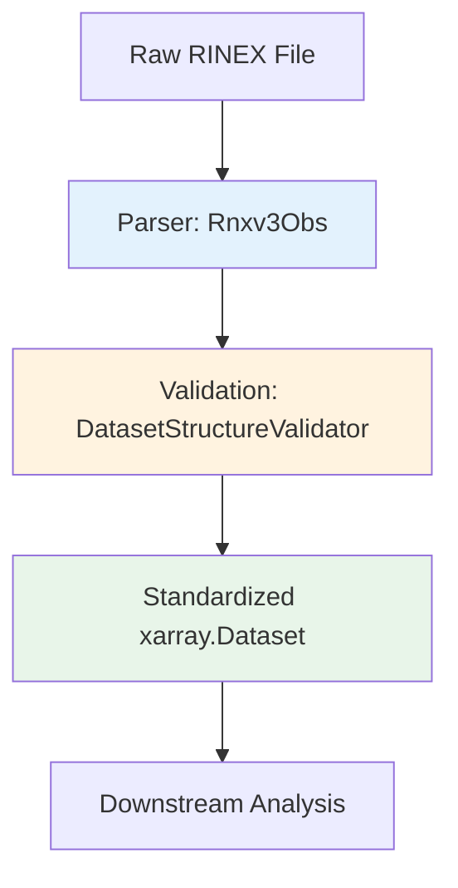
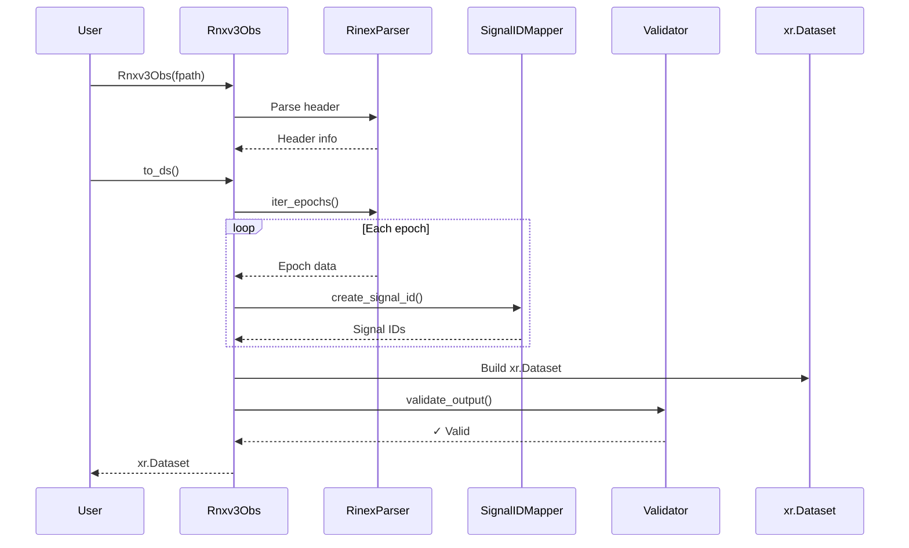

# Overview

## Introduction

The `canvod-readers` package provides robust, validated parsers for GNSS (Global Navigation Satellite System) observation data. It transforms raw RINEX files into analysis-ready xarray Datasets, serving as the foundation for vegetation optical depth (VOD) research using GNSS signal-to-noise ratio (SNR) data.

## The Problem We Solve

GNSS data comes in various formats (RINEX v2, v3, v4, proprietary formats) with complex structures:

- **Complex Headers**: Station metadata, observation types, system information
- **Multiple Constellations**: GPS, GLONASS, Galileo, BeiDou, QZSS, IRNSS, SBAS
- **Variable Frequency Bands**: L1, L2, L5, E1, E5a, E5b, B1, B2, B3, G1, G2, etc.
- **Multiple Observable Types**: SNR, Phase, Pseudorange, Doppler
- **Irregular Data**: Missing epochs, incomplete observations, varying sampling rates

**canvod-readers** handles all these complexities, providing:

✅ **Standardized output format** (xarray.Dataset)
✅ **Automatic validation** (completeness checks, dtype verification)
✅ **Memory efficiency** (lazy loading, iterators)
✅ **Signal disambiguation** (unique Signal IDs)
✅ **Extensibility** (ABC pattern for new formats)

## Design Philosophy

### 1. Separation of Concerns



Each component has a single, well-defined responsibility:

- **Parser (`Rnxv3Obs`)**: Read RINEX, extract observations
- **Validator (`DatasetStructureValidator`)**: Ensure output meets requirements
- **Dataset**: Standard format for downstream processing

### 2. Contract-Based Design

All readers implement the `GNSSDataReader` abstract base class:

```python
from abc import ABC, abstractmethod

class GNSSDataReader(ABC):
    """Every reader must implement these methods."""

    @abstractmethod
    def to_ds(self, **kwargs) -> xr.Dataset:
        """Convert to xarray.Dataset."""

    @abstractmethod
    def iter_epochs(self):
        """Iterate through epochs."""

    @property
    @abstractmethod
    def file_hash(self) -> str:
        """Compute file hash for deduplication."""
```

This **contract** ensures:
- All readers produce compatible output
- Downstream code doesn't need to know which reader was used
- New formats can be added without breaking existing code

### 3. Validation as First-Class Citizen

Every Dataset produced by any reader **must** pass validation:

```python
validator = DatasetStructureValidator(dataset=ds)
validator.validate_all()  # Raises ValueError if invalid
```

Validation checks:
- ✅ Required dimensions: `(epoch, sid)`
- ✅ Required coordinates: `epoch`, `sid`, `sv`, `system`, `band`, `code`, `freq_*`
- ✅ Correct dtypes: `float64` for frequencies, `datetime64[ns]` for epoch
- ✅ Required attributes: `"Created"`, `"RINEX File Hash"`, etc.
- ✅ Minimum data variables: `SNR`, `Phase`

This prevents malformed data from entering the pipeline.

## Use Cases

### 1. Vegetation Optical Depth Research

**Primary use case**: Process GNSS-SNR data for VOD retrieval:

```python
# Step 1: Read RINEX file
reader = Rnxv3Obs(fpath="station.24o")
ds = reader.to_ds(keep_rnx_data_vars=["SNR"])

# Step 2: Filter L-band signals (sensitive to vegetation)
l_band = ds.where(
    ds.band.isin(['L1', 'L2', 'L5']),
    drop=True
)

# Step 3: Pass to VOD calculator (canvod-vod)
from canvod.vod import VODCalculator
vod = VODCalculator(l_band).compute()
```

### 2. Multi-Constellation Analysis

Compare signal quality across GNSS systems:

```python
ds = reader.to_ds()

# Analyze by constellation
for system in ['G', 'R', 'E', 'C']:
    system_ds = ds.where(ds.system == system, drop=True)
    mean_snr = system_ds.SNR.mean(dim=['epoch', 'sid'])
    print(f"{system}: {mean_snr:.2f} dB")
```

### 3. Long-Term Monitoring

Process time series of RINEX files:

```python
from pathlib import Path

rinex_dir = Path("/data/station/2024/")
datasets = []

for rinex_file in sorted(rinex_dir.glob("*.24o")):
    reader = Rnxv3Obs(fpath=rinex_file)
    ds = reader.to_ds(keep_rnx_data_vars=["SNR"])
    datasets.append(ds)

# Concatenate time series
time_series = xr.concat(datasets, dim='epoch')
```

### 4. Quality Control

Identify problematic stations or satellites:

```python
ds = reader.to_ds()

# Find satellites with low SNR
low_snr_sats = ds.where(ds.SNR < 30, drop=True).sv.values
print(f"Low SNR satellites: {set(low_snr_sats)}")

# Check epoch completeness
expected_epochs = 2880  # 30s sampling, 24 hours
actual_epochs = len(ds.epoch)
completeness = (actual_epochs / expected_epochs) * 100
print(f"Epoch completeness: {completeness:.1f}%")
```

## Key Components

### Readers

**Currently Implemented:**
- `Rnxv3Obs`: RINEX v3.04 observation files

**Planned:**
- `Rnxv2Obs`: RINEX v2.11 observation files
- `Rnxv4Obs`: RINEX v4.00 observation files
- `SeptentrioObs`: Septentrio binary format

### GNSS Specifications

The `gnss_specs` module provides constellation-specific information:

```python
from canvod.readers.gnss_specs import GPS, GALILEO, SignalIDMapper

# Get GPS band properties
gps = GPS()
print(gps.BANDS)  # {'1': 'L1', '2': 'L2', '5': 'L5'}
print(gps.BAND_PROPERTIES['L1'])  # freq, bandwidth, system

# Map observation codes to signal IDs
mapper = SignalIDMapper()
sid = mapper.create_signal_id("G01", "G01|S1C")
print(sid)  # "G01|L1|C"
```

### Validators

Ensure data quality and compatibility:

```python
from canvod.readers.base import DatasetStructureValidator

# Validate dataset structure
validator = DatasetStructureValidator(dataset=ds)
validator.validate_dimensions()    # Check (epoch, sid)
validator.validate_coordinates()   # Check required coords
validator.validate_data_variables()  # Check SNR, Phase exist
validator.validate_attributes()    # Check metadata
```

## Data Flow



## Performance Characteristics

### Memory Usage

**Lazy Loading**: RINEX files are read epoch-by-epoch, not loaded entirely into memory:

```python
reader = Rnxv3Obs(fpath="large_file.24o")

# Iterate without loading entire file
for epoch in reader.iter_epochs():
    process(epoch)  # Memory footprint: ~1 MB per epoch
```

**Full Loading**: When converting to Dataset:

```python
ds = reader.to_ds()
# Memory: ~150 MB per 24h file (30s sampling, 4 systems)
```

### Processing Speed

Typical performance (Intel i7, 2024):

| File Size | Epochs | Satellites | Time |
|-----------|--------|------------|------|
| 50 MB     | 2,880  | ~50        | ~3s  |
| 100 MB    | 5,760  | ~80        | ~6s  |
| 500 MB    | 28,800 | ~120       | ~30s |

### Optimization Tips

1. **Filter early**: Use `keep_rnx_data_vars` to limit data variables
2. **System filtering**: Process one constellation at a time for large files
3. **Batch processing**: Use multiprocessing for multiple files
4. **Storage**: Save to Zarr/NetCDF for faster subsequent access

## Comparison with Other Tools

| Feature | canvod-readers | georinex | hatanaka | gnssrefl |
|---------|----------------|----------|----------|----------|
| RINEX v3.04 | ✅ Full | ✅ Full | ❌ | ✅ Full |
| xarray output | ✅ | ✅ | ❌ | ❌ |
| Signal IDs | ✅ | ❌ | ❌ | ❌ |
| Validation | ✅ Built-in | ❌ | ❌ | ❌ |
| Extensible | ✅ ABC | ❌ | ❌ | ❌ |
| VOD pipeline | ✅ Native | ❌ | ❌ | ⚠️ Partial |
| Type safety | ✅ Pydantic | ⚠️ Limited | ❌ | ❌ |

**Key Differences:**
- **Signal IDs**: Unique to canvod-readers, enables unambiguous signal tracking
- **Validation**: Built-in checks ensure pipeline compatibility
- **Type Safety**: Pydantic models catch errors during parsing, not analysis
- **Extensibility**: ABC pattern makes adding formats straightforward

## Next Steps


### 📖 Learn the Architecture
Link: [architecture](architecture.md)

Understand the ABC pattern and how readers are structured

### 🔍 RINEX Reader Details
Link: [rinex_reader](rinex_reader.md)

Deep dive into RINEX v3.04 implementation

### 🧪 Testing Guide
Link: [testing](testing.md)

Learn about test coverage and quality assurance

### 🔧 Add New Readers
Link: [extending_readers](extending_readers.md)

Implement support for new data formats
