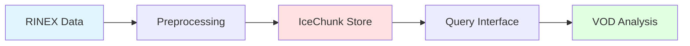

# Overview

## Purpose

`canvod-store` provides storage management for GNSS vegetation optical depth (VOD) data using the IceChunk format. It handles:

1. **Dataset storage** - Efficient storage of RINEX-derived datasets
2. **Preprocessing** - Preparing datasets for storage (padding, normalization)
3. **Storage strategies** - Flexible handling of existing data
4. **Query interface** - Efficient data retrieval

## Architecture



## Core Components

### Storage Manager
Handles store creation, dataset writing, and reading:
```python
from canvod.store import IcechunkStore

store = IcechunkStore(store_path, strategy="append")
store.write(dataset)
```

### Preprocessing Pipeline
Prepares datasets for storage:
```python
from canvod.store.preprocessing import IcechunkPreprocessor

preprocessed = IcechunkPreprocessor.prep_aux_ds(raw_dataset)
```

### Reader Interface
Queries stored data:
```python
from canvod.store.reader import IcechunkReader

reader = IcechunkReader(store_path)
ds = reader.read(time_range=("2024-01-01", "2024-12-31"))
```

## Data Flow

1. **Ingest** - Raw GNSS data (RINEX, SP3, CLK)
2. **Preprocess** - Convert to standard format (sid dimension, padding)
3. **Store** - Write to IceChunk with compression
4. **Query** - Retrieve time ranges or specific signals
5. **Analyze** - VOD calculation and analysis

## Storage Format

Data is stored in IceChunk format with:
- **Chunking** - Optimized for time-series access
- **Compression** - Zstd/LZ4 compression
- **Versioning** - Built-in version control
- **Cloud-ready** - S3-compatible backends
