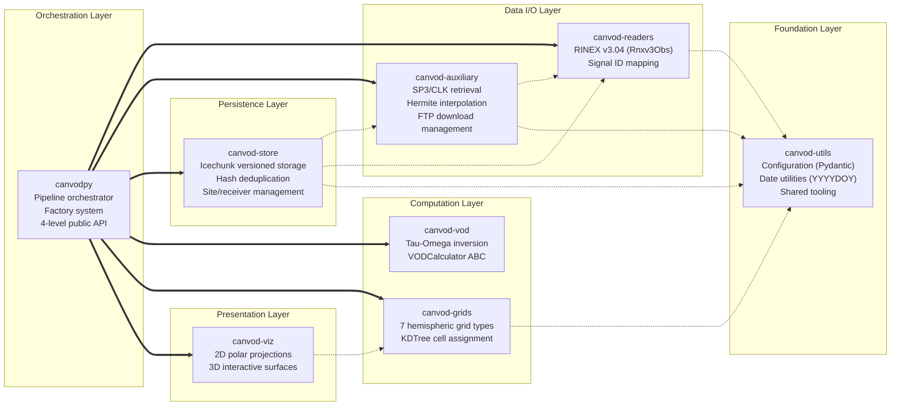
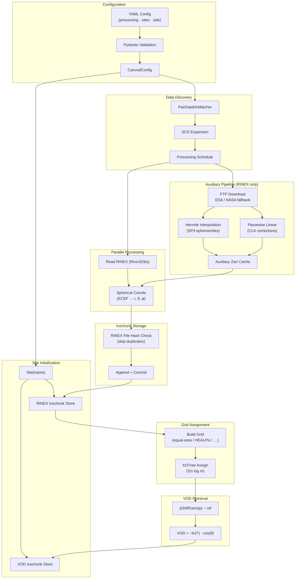

# Monorepo Structure

## Overview

canVODpy is organized as a monorepo containing eight Python packages for GNSS vegetation optical depth analysis. All packages reside in a single repository while maintaining technical independence: each can be developed, tested, and published separately.

---

## Package Layers



---

## Key Design Decisions

<div class="grid cards" markdown>

-   :fontawesome-solid-cubes: &nbsp; **Namespace Packages**

    ---

    All packages share the `canvod.*` namespace — a coherent import API
    backed by separate installable packages:

    ```python
    from canvod.readers import Rnxv3Obs
    from canvod.grids import EqualAreaBuilder
    from canvod.vod import TauOmegaZerothOrder
    ```

    [:octicons-arrow-right-24: Namespace details](namespace-packages.md)

-   :fontawesome-solid-lock: &nbsp; **Workspace Architecture**

    ---

    One `uv sync` installs all packages in editable mode with a shared lockfile.
    Dependencies are resolved together — no version conflicts possible.

    Each package keeps its own `pyproject.toml` for independent PyPI publishing.

-   :fontawesome-solid-plug: &nbsp; **Independent Install**

    ---

    Install only what you need:

    ```bash
    pip install canvod-readers          # Readers only
    pip install canvod-grids canvod-vod # Grid + VOD
    pip install canvodpy                # Everything
    ```

-   :fontawesome-solid-sitemap: &nbsp; **Flat Dependency Graph**

    ---

    Maximum depth = 1. Four foundation packages have zero inter-package
    dependencies. Three consumer packages each depend on exactly one
    foundation package.

</div>

---

## Directory Structure

```
canvodpy/                           # Repository root
  packages/                         # Independent packages
    canvod-readers/
      src/
        canvod/                     # Namespace root (no __init__.py)
          readers/                  # Package code
            __init__.py

      tests/
      pyproject.toml
    canvod-auxiliary/               # Same structure
    canvod-grids/
    canvod-vod/
    canvod-store/
    canvod-viz/
    canvod-utils/
  canvodpy/                         # Umbrella package
    src/
      canvodpy/
        __init__.py                 # Re-exports all subpackages
  docs/                             # Centralized documentation
  pyproject.toml                    # uv workspace config
  uv.lock                           # Shared lockfile
  Justfile                          # Task runner
```

---

## Dependency Graph

```
canvod-readers    ──── no inter-package deps
canvod-grids      ──── no inter-package deps
canvod-vod        ──── no inter-package deps
canvod-utils      ──── no inter-package deps
canvod-auxiliary   ─── depends on canvod-readers
canvod-store      ──── depends on canvod-grids
canvod-viz        ──── depends on canvod-grids
canvodpy          ──── depends on all packages
```

---

## Complete Processing Flow



---

## Trade-offs

!!! success "Advantages"

    - Clear separation of concerns between packages
    - Users install only the components they need
    - Independent testing and development per package
    - Smaller dependency trees for individual packages

!!! warning "Costs"

    - Additional `pyproject.toml` per package
    - Developers must understand the namespace package mechanism
    - Coordinated releases required for consistent versioning
