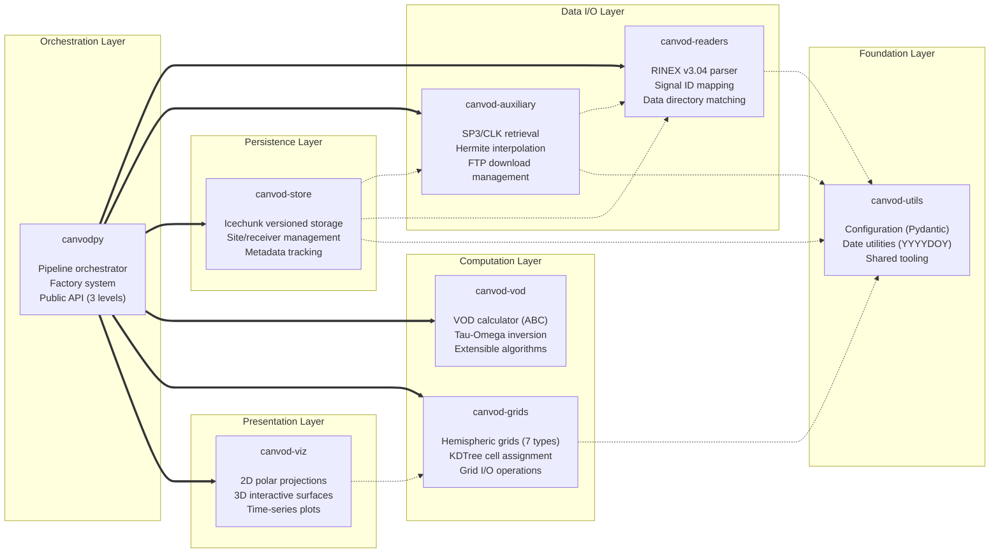

# Monorepo Structure

## Overview

canVODpy is organized as a monorepo containing eight Python packages for GNSS vegetation optical depth analysis. All packages reside in a single repository while maintaining technical independence: each can be developed, tested, and published separately.

## Package Organization

```
canVODpy Monorepo
  canvod-readers    RINEX v3.04 observation file readers
  canvod-auxiliary   SP3 ephemeris and CLK clock correction processing
  canvod-grids      Hemispheric grid implementations
  canvod-vod        VOD estimation algorithms
  canvod-store      Icechunk/Zarr storage backends
  canvod-viz        Visualization utilities
  canvod-utils      Configuration and CLI tools
  canvodpy          Umbrella package (re-exports all subpackages)
```



## Key Design Decisions

### Namespace Packages

All packages share the `canvod.*` namespace, providing a unified import API:

```python
from canvod.readers import Rnxv3Obs
from canvod.grids import EqualAreaBuilder
from canvod.vod import VODCalculator
```

Each import originates from a different installable package, but the shared namespace presents a coherent interface. See [Namespace Packages](namespace-packages.md) for implementation details.

### Workspace Architecture

All packages share a single virtual environment and lockfile:

- One `uv sync` installs all packages in editable mode
- Dependencies are resolved together, preventing version conflicts
- Each package maintains its own `pyproject.toml` for independent publishing

### Package Independence

Each package can be installed independently:

```bash
pip install canvod-readers          # Just the readers
pip install canvod-grids canvod-vod # Grids and VOD only
pip install canvodpy                # Everything
```

## Directory Structure

```
canvodpy/                           # Repository root
  packages/                         # Independent packages
    canvod-readers/
      src/
        canvod/                     # Namespace (no __init__.py)
          readers/                  # Package code
            __init__.py
      tests/
      pyproject.toml
      README.md
    canvod-auxiliary/                # Same structure
      ...
  canvodpy/                         # Umbrella package
    src/
      canvodpy/
        __init__.py                 # Re-exports all subpackages
  docs/                             # Centralized documentation
  pyproject.toml                    # Workspace configuration
  uv.lock                          # Shared lockfile
  Justfile                          # Task runner commands
```

## Dependency Flow

```
canvod-readers    (no inter-package dependencies)
canvod-grids      (no inter-package dependencies)
canvod-vod        (no inter-package dependencies)
canvod-utils      (no inter-package dependencies)
canvod-auxiliary   depends on canvod-readers
canvod-store      depends on canvod-grids
canvod-viz        depends on canvod-grids
canvodpy          depends on all packages
```

The dependency graph is intentionally flat: four foundation packages have zero inter-package dependencies, and three consumer packages each depend on exactly one foundation package. Maximum dependency depth is 1.

## Complete Processing Flow

The following diagram shows the full logical flow of canVODpy — from YAML configuration through data discovery, auxiliary data retrieval, parallel RINEX processing, versioned storage, hemispheric grid assignment, VOD retrieval, and output.

```mermaid
flowchart TD
    %% ── Configuration ──
    subgraph CFG["Configuration"]
        YAML["YAML Config Files\n(processing, sites, sids)"]
        PYDANTIC["Pydantic Validation\n+ Deep Merge with Defaults"]
        CONFIG["CanvodConfig"]
    end

    %% ── Site Initialization ──
    subgraph INIT["Site Initialization"]
        SITE["Site(name)\nLoad receiver configs,\ninitialize stores"]
        RINEX_STORE["RINEX Icechunk Store\n(versioned observations)"]
        VOD_STORE["VOD Icechunk Store\n(versioned retrievals)"]
    end

    %% ── Data Discovery ──
    subgraph DISCOVERY["Data Discovery (per DOY)"]
        MATCHER["PairDataDirMatcher\n(ThreadPoolExecutor)"]
        EXPAND["SCS Expansion\nReference receivers expanded\nper canopy position"]
        SCHEDULE["Processing Schedule\n{date: {group: (dir, type, pos_dir)}}"]
    end

    %% ── Auxiliary Data (once per DOY) ──
    subgraph AUX["Auxiliary Data Pipeline (sequential, once per DOY)"]
        FTP["FTP Download\nESA primary / NASA fallback"]
        SP3_PARSE["Parse SP3 Ephemerides\n(ECEF positions + velocities)"]
        CLK_PARSE["Parse CLK Corrections\n(satellite clock offsets)"]
        EPOCH_GRID["Generate 24h Epoch Grid\n(n = 86400 / sampling_interval)"]
        HERMITE["Hermite Spline Interpolation\n(ephemerides, cubic,\nvelocity-aware)"]
        LINEAR["Piecewise Linear Interpolation\n(clock corrections,\nwindow=9, jump_thr=1e-6)"]
        AUX_ZARR["Merged Auxiliary Zarr\n(cached per DOY)"]
    end

    %% ── Parallel RINEX Processing ──
    subgraph PARALLEL["Parallel RINEX Processing (ProcessPoolExecutor, n workers)"]
        subgraph WORKER["Per Hourly File (independent process)"]
            READ["1. Read RINEX v3.04\n(Rnxv3Obs.to_ds)"]
            FILTER["2. Filter Signals\n(keep_vars, keep_sids)"]
            SLICE_AUX["3. Slice Auxiliary\n(nearest-epoch match)"]
            COMMON_SID["4. Intersect SIDs\n(RINEX ∩ auxiliary)"]
            SPHERICAL["5. Spherical Coordinates\n(ECEF to r, theta, phi\nrelative to receiver position)"]
        end
    end

    %% ── Storage ──
    subgraph WRITE["Icechunk Storage (sequential)"]
        HASH_CHECK["Check RINEX File Hash\n(skip if exists)"]
        NORMALIZE["Normalize Encodings\n(dtype compatibility)"]
        APPEND["Append to Group\n(epoch dimension)"]
        COMMIT["Atomic Commit\n(snapshot ID)"]
        META["Update Metadata\n(hash, epochs, snapshot,\ntimestamp)"]
    end

    %% ── Grid Assignment ──
    subgraph GRID["Hemispheric Grid Assignment"]
        BUILD_GRID["Construct Grid\n(equal-area, HEALPix,\ngeodesic, fibonacci, ...)"]
        KDTREE["Build KDTree\n(cell centres in\nCartesian coordinates)"]
        ASSIGN["Spatial Query\n(O(n log m) per observation)"]
    end

    %% ── VOD Retrieval ──
    subgraph VOD["VOD Retrieval"]
        LOAD_C["Load Canopy Dataset\n(from RINEX store)"]
        LOAD_R["Load Reference Dataset\n(from RINEX store,\nSCS-matched group)"]
        DELTA["Compute Delta-SNR\n(SNR_canopy - SNR_ref)"]
        TRANSMISSIVITY["Convert to Transmissivity\n(10^(Delta-SNR/10))"]
        TAU["Tau-Omega Inversion\nVOD = -ln(T) * cos(theta)"]
        VOD_DS["VOD Dataset\n(per sid, epoch, cell)"]
    end

    %% ── Output ──
    subgraph OUTPUT["Output"]
        VOD_WRITE["Write to VOD Store\n(versioned, per analysis pair)"]
        VIZ_2D["2D Hemispheric Plot\n(polar projection)"]
        VIZ_3D["3D Interactive Surface\n(Plotly)"]
        EXPORT["Data Export\n(NetCDF, CSV, Zarr)"]
    end

    %% ── Connections ──

    %% Config flow
    YAML --> PYDANTIC --> CONFIG
    CONFIG --> SITE
    SITE --> RINEX_STORE
    SITE --> VOD_STORE

    %% Discovery
    CONFIG --> MATCHER
    MATCHER --> EXPAND
    EXPAND --> SCHEDULE

    %% Auxiliary pipeline
    SCHEDULE --> FTP
    FTP --> SP3_PARSE
    FTP --> CLK_PARSE
    SP3_PARSE --> HERMITE
    CLK_PARSE --> LINEAR
    SCHEDULE --> EPOCH_GRID
    EPOCH_GRID --> HERMITE
    EPOCH_GRID --> LINEAR
    HERMITE --> AUX_ZARR
    LINEAR --> AUX_ZARR

    %% Parallel processing
    SCHEDULE --> READ
    READ --> FILTER
    FILTER --> SLICE_AUX
    AUX_ZARR --> SLICE_AUX
    SLICE_AUX --> COMMON_SID
    COMMON_SID --> SPHERICAL

    %% Storage
    SPHERICAL --> HASH_CHECK
    HASH_CHECK --> NORMALIZE
    NORMALIZE --> APPEND
    APPEND --> COMMIT
    COMMIT --> META
    META --> RINEX_STORE

    %% Grid
    RINEX_STORE --> BUILD_GRID
    BUILD_GRID --> KDTREE
    KDTREE --> ASSIGN

    %% VOD
    ASSIGN --> LOAD_C
    ASSIGN --> LOAD_R
    LOAD_C --> DELTA
    LOAD_R --> DELTA
    DELTA --> TRANSMISSIVITY
    TRANSMISSIVITY --> TAU
    TAU --> VOD_DS

    %% Output
    VOD_DS --> VOD_WRITE
    VOD_WRITE --> VOD_STORE
    VOD_DS --> VIZ_2D
    VOD_DS --> VIZ_3D
    VOD_DS --> EXPORT
```



## Trade-offs

**Advantages:**
- Clear separation of concerns between packages
- Users install only the components they need
- Independent testing and development per package
- Smaller dependency trees for individual packages

**Costs:**
- Additional configuration files per package
- Developers must understand the namespace package mechanism
- Coordinated releases required for version consistency
