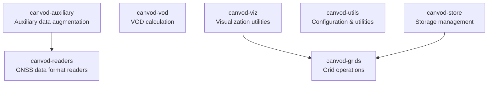

# Package Dependencies

Inter-package dependency relationships and independence metrics for the canVODpy monorepo.

## Dependency Graph



**Legend:**
- Green (Stable): No dependencies, used by other packages
- Pink (Leaf): Has dependencies, not depended upon by others

## Independence Metrics

| Package | Dependencies | Dependents | Instability | Independence |
|---------|--------------|------------|-------------|--------------|
| canvod-readers | 0 | 1 | 0.00 | 1.00 |
| canvod-grids | 0 | 2 | 0.00 | 1.00 |
| canvod-vod | 0 | 0 | 0.00 | 1.00 |
| canvod-utils | 0 | 0 | 0.00 | 1.00 |
| canvod-auxiliary | 1 | 0 | 1.00 | 0.83 |
| canvod-viz | 1 | 0 | 1.00 | 0.83 |
| canvod-store | 1 | 0 | 1.00 | 0.83 |

### Metric Definitions

- **Efferent coupling (Ce)**: Number of packages this package depends on. Lower values indicate greater independence.
- **Afferent coupling (Ca)**: Number of packages that depend on this package. Higher values indicate greater reusability.
- **Instability (I)**: `Ce / (Ce + Ca)`. 0.0 = maximally stable (foundation), 1.0 = maximally unstable (leaf).
- **Independence**: `1 - (Ce / total_packages)`. 1.0 = no inter-package dependencies.

## Architecture Summary

- No circular dependencies
- 4 packages with zero inter-package dependencies (57%)
- 3 total internal dependency edges
- Maximum dependency depth: 1

### Dependency Layers

```
Layer 0 (Foundation, 0 dependencies):
  canvod-readers, canvod-grids, canvod-vod, canvod-utils

Layer 1 (Consumers, 1 dependency each):
  canvod-auxiliary (depends on canvod-readers)
  canvod-viz (depends on canvod-grids)
  canvod-store (depends on canvod-grids)
```

The two-layer structure simplifies testing (test Layer 0 first, then Layer 1) and ensures that changes to foundation packages do not cascade between siblings.

## Extractability

All packages can be extracted to independent repositories with zero or minimal changes:

```
# Foundation packages: extract directly
packages/canvod-readers/  -> independent repo
packages/canvod-grids/    -> independent repo
packages/canvod-vod/      -> independent repo
packages/canvod-utils/    -> independent repo

# Consumer packages: extract with one PyPI dependency
packages/canvod-auxiliary/ -> independent repo (+ canvod-readers)
packages/canvod-viz/      -> independent repo (+ canvod-grids)
packages/canvod-store/    -> independent repo (+ canvod-grids)
```

## Regeneration

```bash
just deps-report    # Full metrics report
just deps-graph     # Mermaid diagram
```
