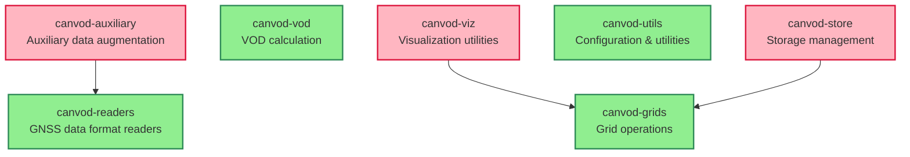

# Package Dependencies

This document shows the dependency relationships between canVODpy packages and provides metrics to help maintain independence (Sollbruchstellen).

## Dependency Graph



**Legend:**
- 🟢 **Green (Stable)** - No dependencies, used by others
- 🔴 **Pink (Unstable)** - Has dependencies, not used by others (leaf packages)
- 🔵 **Blue (Balanced)** - Mix of dependencies and dependents

## Independence Metrics

| Package | Dependencies | Dependents | Instability | Independence | Status |
|---------|--------------|------------|-------------|--------------|--------|
| canvod-readers | 0 | 1 | 0.00 | 1.00 | 🟢 Stable |
| canvod-grids | 0 | 2 | 0.00 | 1.00 | 🟢 Stable |
| canvod-vod | 0 | 0 | 0.00 | 1.00 | 🟢 Stable |
| canvod-utils | 0 | 0 | 0.00 | 1.00 | 🟢 Stable |
| canvod-auxiliary | 1 | 0 | 1.00 | 0.83 | 🔴 Leaf |
| canvod-viz | 1 | 0 | 1.00 | 0.83 | 🔴 Leaf |
| canvod-store | 1 | 0 | 1.00 | 0.83 | 🔴 Leaf |

### Metrics Explained

**Efferent Coupling (Ce):** Number of packages this package depends on
- Lower is better for independence

**Afferent Coupling (Ca):** Number of packages that depend on this package  
- Higher means more reusable

**Instability (I):** `Ce / (Ce + Ca)`
- 0.00 = Maximally stable (foundation packages)
- 1.00 = Maximally unstable (leaf packages)
- Neither is bad - depends on role!

**Independence:** `1 - (Ce / total_packages)`
- How independent this package is from others
- 1.00 = Perfect independence

## Architecture Analysis

### ✅ Excellent Independence!

Your architecture has:
- **No circular dependencies** ✅
- **4 packages with zero dependencies** (57%)
- **Only 3 total internal dependencies**
- **Maximum dependency depth: 1** (very shallow!)

### Foundation Packages (0 dependencies)

These packages form the **stable core** and can be used independently:

1. **canvod-readers** - RINEX and data format readers
   - Used by: canvod-auxiliary
   - Role: Data ingestion foundation

2. **canvod-grids** - Grid operations (HEALPix, hemispheric)
   - Used by: canvod-viz, canvod-store
   - Role: Spatial foundation

3. **canvod-vod** - VOD calculations
   - Used by: (none - ready for use by umbrella package)
   - Role: Core algorithm

4. **canvod-utils** - Configuration and utilities
   - Used by: (none - ready for cross-package use)
   - Role: Shared utilities

### Leaf Packages (No dependents)

These packages **consume** foundation packages but aren't used by others:

1. **canvod-auxiliary** → canvod-readers
2. **canvod-viz** → canvod-grids
3. **canvod-store** → canvod-grids

**This is good!** Leaf packages are easy to extract and can evolve independently.

## Sollbruchstellen (Breaking Points)

Your packages have **excellent breaking points**:

### Easy to Extract

All 7 packages can be extracted to independent repositories with **zero or minimal changes**:

```bash
# Each package is already independent
packages/canvod-readers/  → github.com/you/canvod-readers
packages/canvod-grids/    → github.com/you/canvod-grids
packages/canvod-vod/      → github.com/you/canvod-vod
packages/canvod-utils/    → github.com/you/canvod-utils

# These need their single dependency:
packages/canvod-auxiliary/      → github.com/you/canvod-auxiliary (+ canvod-readers)
packages/canvod-viz/      → github.com/you/canvod-viz (+ canvod-grids)
packages/canvod-store/    → github.com/you/canvod-store (+ canvod-grids)
```

### Dependency Layers

```
Layer 0 (Foundation - 4 packages):
  canvod-readers, canvod-grids, canvod-vod, canvod-utils

Layer 1 (Consumers - 3 packages):
  canvod-auxiliary, canvod-viz, canvod-store
```

Only **2 layers**! This is excellent for:
- ✅ Testing (test layer 0 first, then layer 1)
- ✅ Versioning (changes in layer 0 don't affect siblings)
- ✅ Extraction (clean separation)

## Recommendations

### Current State: 🟢 Excellent

Your dependency architecture is **very good**. You've achieved:
- Minimal coupling
- No circular dependencies
- Clear foundation vs. consumer separation
- Easy extraction points

### Potential Improvements

#### 1. Consider Making canvod-utils a Universal Dependency

Currently, `canvod-utils` has zero dependents. Consider if other packages should use it for:
- Configuration loading
- Metadata management
- Shared constants

**Trade-off:**
- ✅ Reduced duplication
- ⚠️ Increased coupling

#### 2. Future: Orchestrator Package

When you create the high-level API (orchestrator), it will naturally depend on multiple packages. Plan for:

```
canvodpy (umbrella)
  ├── canvod-readers
  ├── canvod-auxiliary
  ├── canvod-grids
  ├── canvod-vod
  ├── canvod-store
  └── canvod-viz
```

This is **expected and good** - the umbrella package should coordinate all others.

#### 3. Monitor Future Dependencies

As packages evolve, watch for:
- Circular dependencies (currently: 0 ✅)
- Deep dependency chains (currently: max depth 1 ✅)
- High coupling (currently: max 1 dependency per package ✅)

## Updating This Document

Regenerate the dependency analysis anytime:

```bash
# Generate full report
just deps-report

# Generate Mermaid diagram only
just deps-graph

# Generate detailed metrics
python scripts/analyze_dependencies.py --format report > DEPENDENCIES.md
```

## See Also

- [Architecture Overview](architecture.md) - Overall system design
- [Development Workflow](development-workflow.md) - How to work with packages
- [Namespace Packages](namespace-packages.md) - Package structure
