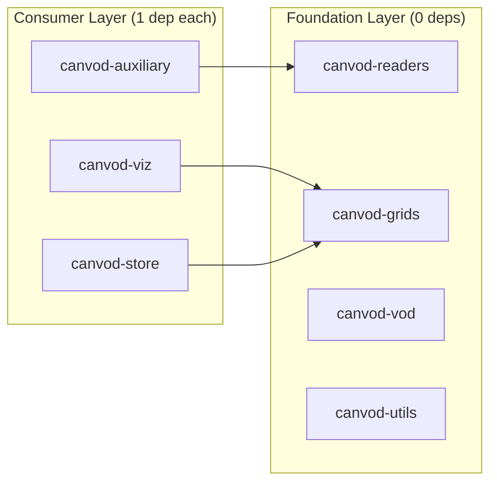

# Package Dependencies

Inter-package dependency relationships and independence metrics for the canVODpy monorepo.

---

## Dependency Graph



---

## Independence Metrics

| Package | Ce (deps) | Ca (dependents) | Instability | Independence |
|---------|:---------:|:---------------:|:-----------:|:------------:|
| canvod-readers | 0 | 1 | 0.00 | 1.00 |
| canvod-grids | 0 | 2 | 0.00 | 1.00 |
| canvod-vod | 0 | 0 | 0.00 | 1.00 |
| canvod-utils | 0 | 0 | 0.00 | 1.00 |
| canvod-auxiliary | 1 | 0 | 1.00 | 0.83 |
| canvod-viz | 1 | 0 | 1.00 | 0.83 |
| canvod-store | 1 | 0 | 1.00 | 0.83 |

??? note "Metric definitions"
    - **Ce (efferent coupling)** — packages this package depends on. Lower = more independent.
    - **Ca (afferent coupling)** — packages that depend on this one. Higher = more reusable.
    - **Instability** — `Ce / (Ce + Ca)`. 0.0 = maximally stable (foundation). 1.0 = maximally unstable (leaf).
    - **Independence** — `1 − (Ce / total_packages)`. 1.0 = no inter-package dependencies.

---

## Architecture Summary

!!! success "Flat dependency graph"
    - **No circular dependencies**
    - 4 of 7 packages (57 %) have zero inter-package dependencies
    - 3 total internal dependency edges
    - **Maximum depth = 1** — a consumer depends on a foundation; foundations never depend on each other

This two-layer structure simplifies testing (test Layer 0 packages first, then Layer 1) and ensures that changes to a foundation package do not cascade to sibling packages.

---

## Extractability

All packages can be extracted to independent repositories with zero or minimal changes:

=== "Foundation packages"

    ```bash
    # Extract directly — no internal dependencies
    packages/canvod-readers/  → independent repo
    packages/canvod-grids/    → independent repo
    packages/canvod-vod/      → independent repo
    packages/canvod-utils/    → independent repo
    ```

=== "Consumer packages"

    ```bash
    # Extract + add one PyPI dependency
    packages/canvod-auxiliary/ → independent repo (+ canvod-readers on PyPI)
    packages/canvod-viz/       → independent repo (+ canvod-grids on PyPI)
    packages/canvod-store/     → independent repo (+ canvod-grids on PyPI)
    ```

---

## Regenerate Reports

```bash
just deps-report    # Full metrics report
just deps-graph     # Mermaid dependency diagram
```
