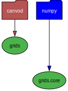
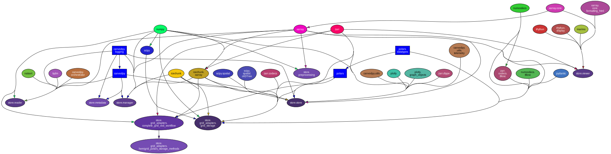

# Dependency Graphs

Visual dependency analysis for canVODpy packages.

## Package-Level Dependencies (Internal)

Shows how classes and modules import each other within each package:

### canvod-readers


### canvod-aux


### canvod-grids



### canvod-vod


### canvod-store



### canvod-viz


### canvod-utils


## API Orchestration

Shows how the umbrella package (canvodpy) orchestrates all components:


## Configuration Flow

Shows how configuration flows through the system:


## Regenerating Graphs

```bash
# Regenerate all graphs
python scripts/generate_dependency_graphs.py --all

# Regenerate specific package
python scripts/generate_dependency_graphs.py --package canvod-readers

# Regenerate API graph only
python scripts/generate_dependency_graphs.py --api
```

## Reading the Graphs

- **Arrows** show import direction (A → B means A imports B)
- **Clusters** group related modules together
- **Colors** distinguish different modules/packages

**Generated:** Auto-updated during development