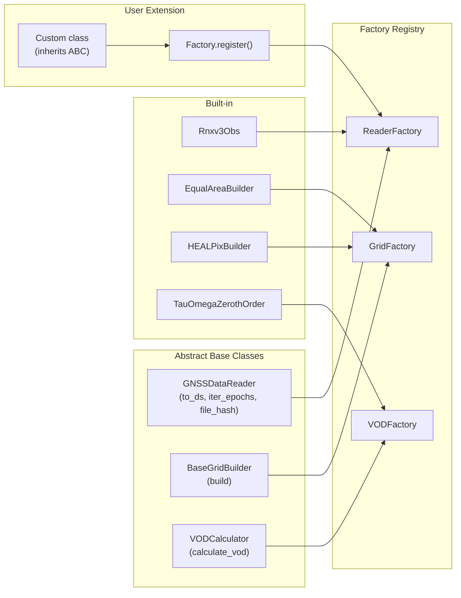
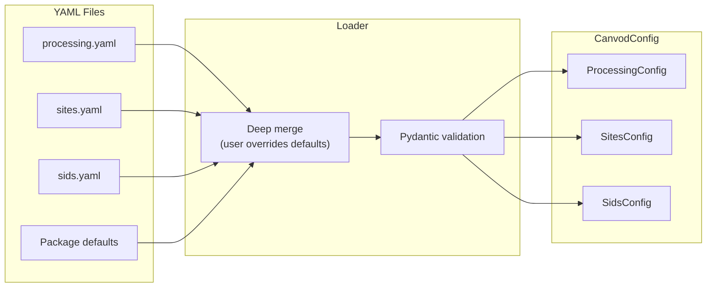

# Architecture and Design Patterns

This page documents the design principles and extensibility patterns used throughout canVODpy.

---

## Design Principles

<div class="grid cards" markdown>

-   :fontawesome-solid-cubes: &nbsp; **Modularity**

    ---

    Independent packages with minimal coupling.
    Install only what you need; replace only what you must.

-   :fontawesome-solid-puzzle-piece: &nbsp; **Extensibility**

    ---

    ABC + Factory pattern throughout. Add a custom reader, grid,
    or VOD algorithm in < 50 lines — no framework internals to understand.

-   :fontawesome-solid-shield-halved: &nbsp; **Type Safety**

    ---

    Modern Python type hints + Pydantic validation at every boundary.
    Errors surface at construction time, not during analysis.

-   :fontawesome-solid-microscope: &nbsp; **Scientific Focus**

    ---

    Explicit over implicit. Reproducible by default — every dataset
    is traceable to a config version, file hash, and Icechunk snapshot ID.

</div>

---

## The Sollbruchstellen Principle

canVODpy applies the engineering concept of *Sollbruchstellen* (predetermined breaking points): packages are designed to be independent so they can be used separately or replaced without affecting the rest of the system.

```
Foundation (0 inter-package dependencies):
  canvod-readers, canvod-grids, canvod-vod, canvod-utils

Consumer (1 dependency each):
  canvod-auxiliary → canvod-readers
  canvod-viz       → canvod-grids
  canvod-store     → canvod-grids

Orchestration:
  canvodpy         → all packages
```

---

## ABC + Factory Pattern



### Registration + Usage

```python
from canvodpy import ReaderFactory
from canvod.readers import GNSSDataReader

class MyLabReader(GNSSDataReader):
    def to_ds(self, keep_rnx_data_vars=None) -> xr.Dataset:
        ...

# Register once (at import time)
ReaderFactory.register("mylab_v1", MyLabReader)

# Use anywhere
reader = ReaderFactory.create("mylab_v1", fpath=path)
ds = reader.to_ds()
```

---

## Unified API Surface

canvodpy exposes four API levels — all backed by the same packages:

=== "Level 1 — Convenience Functions"

    ```python
    from canvodpy import process_date, calculate_vod

    data = process_date("Rosalia", "2025001")
    vod  = calculate_vod("Rosalia", "canopy_01", "reference_01", "2025001")
    ```

=== "Level 2 — Fluent Workflow"

    Steps are recorded but not executed until a terminal method is called.

    ```python
    import canvodpy

    result = (canvodpy.workflow("Rosalia")
        .read("2025001")
        .preprocess()
        .grid("equal_area", angular_resolution=5.0)
        .vod("canopy_01", "reference_01")
        .result())

    # Preview without executing
    plan = canvodpy.workflow("Rosalia").read("2025001").preprocess().explain()
    ```

=== "Level 3 — VODWorkflow"

    ```python
    from canvodpy import VODWorkflow

    wf       = VODWorkflow(site="Rosalia", grid="equal_area")
    datasets = wf.process_date("2025001")
    vod      = wf.calculate_vod("canopy_01", "reference_01", "2025001")
    ```

=== "Level 4 — Direct Package Access"

    ```python
    from canvod.readers import Rnxv3Obs
    from canvod.grids   import EqualAreaBuilder
    from canvod.vod     import TauOmegaZerothOrder

    reader = Rnxv3Obs(fpath=Path("station.25o"))
    ds = reader.to_ds(keep_rnx_data_vars=["SNR"])
    ```

---

## Configuration Management



```python
from canvod.utils.config import load_config

cfg = load_config()
cfg.processing.aux_data.nasa_earthdata_acc_mail
cfg.processing.storage.gnss_root_dir
```

```bash
just config-init      # Create config files from templates
just config-validate  # Validate current config
just config-show      # Print resolved config
```

---

## Provenance and Reproducibility

Every dataset produced by canVODpy is fully traceable:

!!! success "Full provenance chain"
    | Field | Source |
    |-------|--------|
    | `ds.attrs["RINEX File Hash"]` | SHA-256 of raw input file |
    | `ds.attrs["Software"]` | `canvod-readers x.y.z` |
    | `ds.attrs["Created"]` | ISO 8601 timestamp |
    | Icechunk snapshot ID | Hash-addressable, immutable |
    | Config version | Committed alongside code |

---

## Airflow / Distributed Execution

Level 1 API functions are stateless and suitable for distributed scheduling:

```python
from airflow.decorators import task

@task
def process_rinex_task(file_path: str, date: str) -> str:
    from canvodpy import read_rinex
    obs = read_rinex(file_path, date)
    obs.to_zarr(f"/data/obs_{date}.zarr")
    return f"/data/obs_{date}.zarr"
```

Factory registration happens at module import time — each worker process has access to all registered implementations automatically.
