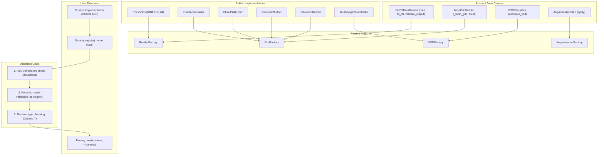
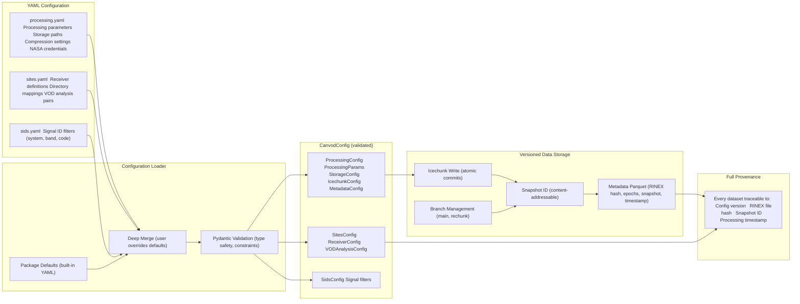

# Architecture and Design Patterns

## Design Principles

canvodpy follows these principles:

1. **Modularity**: Independent, reusable packages with minimal coupling
2. **Extensibility**: ABC + Factory pattern for user-defined implementations
3. **Type safety**: Modern Python type hints with Pydantic validation
4. **Simplicity**: Explicit over implicit; no framework dependencies
5. **Scientific focus**: Optimized for research workflows and reproducibility

## Package Architecture

### The Sollbruchstellen Principle

canvodpy applies the engineering concept of *Sollbruchstellen* (predetermined breaking points): packages are designed to be independent so they can be used separately or replaced without affecting the rest of the system.

### Independence Metrics

- No circular dependencies
- 4 packages with zero inter-package dependencies (57%)
- Only 3 total internal dependency edges
- Maximum dependency depth: 1

### Dependency Layers

```
Foundation (0 dependencies):
  canvod-readers, canvod-grids, canvod-vod, canvod-utils

Consumer (1 dependency):
  canvod-auxiliary -> canvod-readers
  canvod-viz -> canvod-grids
  canvod-store -> canvod-grids

Orchestration:
  canvodpy -> all packages
```

## ABC + Factory Pattern



### Abstract Base Class (Contract)

```python
from abc import ABC, abstractmethod
import xarray as xr

class GNSSDataReader(ABC):
    """Abstract base class for GNSS data format readers."""

    @abstractmethod
    def to_ds(self, keep_rnx_data_vars=None) -> xr.Dataset:
        """Convert data to xarray Dataset."""

    @property
    @abstractmethod
    def metadata(self) -> dict:
        """Return file metadata."""
```

### Concrete Implementation

```python
class Rnxv3Obs(GNSSDataReader):
    """RINEX 3.04 observation file reader."""

    def to_ds(self, keep_rnx_data_vars=None) -> xr.Dataset:
        return xr.Dataset(...)

    @property
    def metadata(self) -> dict:
        return {"version": "3.04", ...}
```

### Type-Safe Factory

```python
from typing import Generic, TypeVar

T = TypeVar('T')

class ComponentFactory(Generic[T]):
    """Generic factory with type-safe registration and creation."""

    _registry: dict[str, type[T]] = {}

    @classmethod
    def register(cls, name: str, component_class: type[T]) -> None:
        cls._registry[name] = component_class

    @classmethod
    def create(cls, name: str, **kwargs) -> T:
        if name not in cls._registry:
            raise ValueError(f"Unknown component: {name}")
        return cls._registry[name](**kwargs)

    @classmethod
    def list_available(cls) -> list[str]:
        return list(cls._registry.keys())

class ReaderFactory(ComponentFactory[GNSSDataReader]):
    pass

class GridFactory(ComponentFactory[BaseGridBuilder]):
    pass
```

### User Extensibility

```python
from canvodpy import ReaderFactory
from canvod.readers import GNSSDataReader

class MyLabReader(GNSSDataReader):
    def to_ds(self, keep_rnx_data_vars=None) -> xr.Dataset:
        return xr.Dataset(...)

    @property
    def metadata(self) -> dict:
        return {"format": "mylab_v1"}

ReaderFactory.register("mylab_v1", MyLabReader)
```

## Unified API Surface

canvodpy provides four API levels, all accessing the same underlying packages:

### Level 1 — Convenience Functions

```python
from canvodpy import process_date, calculate_vod

data = process_date("Rosalia", "2025001")
vod  = calculate_vod("Rosalia", "canopy_01", "reference_01", "2025001")
```

### Level 2 — Fluent Workflow (Deferred Execution)

Steps are recorded but not executed until a terminal method is called.
Powered by `@step` and `@terminal` decorators.

```python
import canvodpy

result = (canvodpy.workflow("Rosalia")
    .read("2025001")
    .preprocess()
    .grid("equal_area", angular_resolution=5.0)
    .vod("canopy_01", "reference_01")
    .result())

# Preview without executing:
plan = canvodpy.workflow("Rosalia").read("2025001").preprocess().explain()
```

The `@step` decorator appends `(method, args, kwargs)` to an internal plan
list and returns `self` for chaining. The `@terminal` decorator replays all
recorded steps, clears the plan, then runs the terminal method.

### Level 3 — VODWorkflow (Eager Execution)

```python
from canvodpy import VODWorkflow

wf = VODWorkflow(site="Rosalia", grid="equal_area")
datasets = wf.process_date("2025001")
vod = wf.calculate_vod("canopy_01", "reference_01", "2025001")
```

### Level 4 — Functional API

```python
from canvodpy import read_rinex, create_grid, assign_grid_cells

ds   = read_rinex(path, reader="rinex3")
grid = create_grid(grid_type="equal_area", angular_resolution=5.0)
ds   = assign_grid_cells(ds, grid)
```

### Direct Package Access

```python
from canvod.readers import Rnxv3Obs
from canvod.grids import EqualAreaBuilder
from canvod.vod import VODCalculator
```

## Configuration Management



All configuration is managed through YAML files validated by Pydantic models:

- **`config/processing.yaml`** — Processing parameters, storage paths, metadata, NASA CDDIS credentials
- **`config/sites.yaml`** — Site definitions and receiver mappings
- **`config/sids.yaml`** — Signal ID filtering rules

```python
from canvod.utils.config import load_config

cfg = load_config()
cfg.processing.aux_data.nasa_earthdata_acc_mail  # Optional NASA CDDIS email
cfg.processing.storage.gnss_root_dir             # Data directory
```

Initialize configuration with `just config-init`, inspect with `just config-show`.

## Airflow Compatibility

API functions are stateless, suitable for distributed execution:

```python
from airflow.decorators import task

@task
def process_rinex_task(file_path: str, date: str) -> str:
    from canvodpy import read_rinex
    obs = read_rinex(file_path, date)
    output = f"/data/obs_{date}.zarr"
    obs.to_zarr(output)
    return output
```

Factory registration occurs at module import time, ensuring each worker process has access to all registered implementations.
