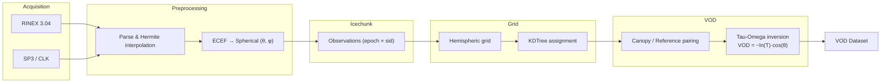

<div class="hero" markdown>

# canVODpy

**An Open Python Ecosystem for GNSS-Transmissometry Canopy VOD Retrievals**

canVODpy aims to be the central community-driven software suite for deriving
and analyzing canopy Vegetation Optical Depth (VOD) from GNSS
signal-to-noise ratio observations.

[](https://doi.org/10.5281/zenodo.18636775)
[](https://pypi.org/project/canvodpy/)
[](https://opensource.org/licenses/Apache-2.0)

[Get started :fontawesome-solid-arrow-right:](guides/getting-started.md){ .md-button .md-button--primary }

</div>

---

## What makes canVODpy different

<div class="grid cards" markdown>

-   :fontawesome-solid-layer-group: &nbsp; **Single unified dataset format**

    ---

    Every reader produces an identical `(epoch × sid)` xarray Dataset
    that passes structural validation. Downstream code is reader-agnostic.

    [:octicons-arrow-right-24: Reader Architecture](packages/readers/architecture.md)

-   :fontawesome-solid-database: &nbsp; **Versioned, cloud-native storage**

    ---

    Icechunk gives every append a git-like commit snapshot.
    Reproducible reads, safe parallel writes, S3-ready.

    [:octicons-arrow-right-24: canvod-store](packages/store/overview.md)

-   :fontawesome-solid-globe: &nbsp; **Hemispheric grid system**

    ---

    Equal-area, HEALPix, geodesic and four more grid types.
    KDTree cell assignment in O(n log m).

    [:octicons-arrow-right-24: canvod-grids](packages/grids/overview.md)

-   :fontawesome-solid-code: &nbsp; **Four API levels**

    ---

    One-liner convenience functions · Fluent workflow · `VODWorkflow` class ·
    Fully stateless functional API for Airflow / Prefect.

    [:octicons-arrow-right-24: Quick Start](#quick-start)

-   :fontawesome-solid-rotate: &nbsp; **Parallel processing pipeline**

    ---

    `ProcessPoolExecutor`-backed pipeline with per-file commit,
    hash deduplication, and cooperative distributed writing.

    [:octicons-arrow-right-24: Architecture](architecture.md)

</div>

---

## Supported receiver formats

<div class="grid" markdown>

!!! success "RINEX v3.04"

    Text-based standard format from all manufacturers.
    Satellite geometry computed from SP3 + CLK precise ephemerides.

    **Reader:** `Rnxv3Obs` — all GNSS constellations, all bands

</div>

---

## Quick Start

```bash
pip install canvodpy
```

=== "Level 1 — Convenience"

    Two lines, everything automatic:

    ```python
    from canvodpy import process_date, calculate_vod

    data = process_date("Rosalia", "2025001")
    vod  = calculate_vod("Rosalia", "canopy_01", "reference_01", "2025001")
    ```

=== "Level 2 — Fluent workflow"

    Deferred execution, chainable steps:

    ```python
    import canvodpy

    result = (
        canvodpy.workflow("Rosalia")
            .read("2025001")
            .preprocess()
            .grid("equal_area", angular_resolution=5.0)
            .vod("canopy_01", "reference_01")
            .result()
    )
    ```

=== "Level 3 — VODWorkflow"

    Eager execution with structured logging:

    ```python
    from canvodpy import VODWorkflow

    wf  = VODWorkflow(site="Rosalia", grid="equal_area")
    vod = wf.calculate_vod("canopy_01", "reference_01", "2025001")
    ```

---

## Processing Pipeline



---

## Packages

<div class="grid cards" markdown>

-   :fontawesome-solid-book-open: &nbsp; **canvod-readers**

    ---

    RINEX v3.04 parsing with signal ID mapping.
    Unified `(epoch × sid)` output with full validation.

-   :fontawesome-solid-cloud-arrow-down: &nbsp; **canvod-auxiliary**

    ---

    SP3 ephemeris and CLK clock retrieval.
    Hermite spline interpolation, FTP fallback chain.

-   :fontawesome-solid-border-all: &nbsp; **canvod-grids**

    ---

    7 hemispheric grid types — equal-area, HEALPix, geodesic and more.
    KDTree-backed O(n log m) cell assignment.

-   :fontawesome-solid-leaf: &nbsp; **canvod-vod**

    ---

    VOD estimation via zeroth-order tau-omega model.
    Extensible `VODCalculator` ABC.

-   :fontawesome-solid-database: &nbsp; **canvod-store**

    ---

    Icechunk versioned storage with per-file hash deduplication.
    S3-compatible backends, ACID commits.

-   :fontawesome-solid-chart-line: &nbsp; **canvod-viz**

    ---

    2D polar hemisphere plots and 3D interactive Plotly surfaces.

-   :fontawesome-solid-gear: &nbsp; **canvod-utils**

    ---

    Pydantic configuration, YYYYDOY date utilities, shared tooling.

-   :fontawesome-solid-circle-nodes: &nbsp; **canvodpy**

    ---

    Umbrella package — four API levels, factory system, unified entry point.

</div>

---

## Technology

<div class="grid" markdown>

!!! abstract "Scientific stack"

    `xarray` · `NumPy` · `SciPy` · `Polars`

!!! abstract "Storage"

    `Icechunk` · `Zarr` · S3-compatible

!!! abstract "Code quality"

    `ruff` · `ty` · `pytest` · `uv`

!!! abstract "Documentation"

    `Zensical` · `beautiful-mermaid` · `marimo` notebooks

</div>

---

## Affiliation

**Climate and Environmental Remote Sensing Research Unit (CLIMERS)**
Department of Geodesy and Geoinformation, TU Wien

[tuwien.at/en/mg/geo/climers](https://www.tuwien.at/en/mg/geo/climers){ .md-button }
