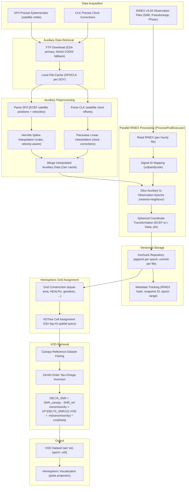

<div class="hero" markdown>

# canVODpy

**An Open Python Ecosystem for GNSS-Transmissometry Canopy VOD Retrievals**

canVODpy aims to be the central community-driven software suite for deriving and
analyzing canopy Vegetation Optical Depth (VOD) from GNSS signal-to-noise ratio observations.

[](https://doi.org/10.5281/zenodo.18636775)
[](https://pypi.org/project/canvodpy/)
[](https://opensource.org/licenses/Apache-2.0)

[Get started](guides/getting-started.md){ .md-button .md-button--primary }
[View on GitHub](https://github.com/nfb2021/canvodpy){ .md-button }

</div>

---

## Processing Pipeline



## Packages

| Package | Description |
|---------|-------------|
| **canvod-readers** | RINEX v3.04 observation file parsing with validation |
| **canvod-auxiliary** | SP3 ephemeris and CLK clock correction processing |
| **canvod-grids** | Hemispheric grid implementations (HEALPix, equal-area) |
| **canvod-vod** | VOD estimation using the tau-omega model |
| **canvod-store** | Versioned storage via Icechunk |
| **canvod-viz** | 2D and 3D hemispheric visualization |
| **canvod-utils** | Configuration management and CLI |
| **canvodpy** | Umbrella package providing unified access |

## Quick Start

```bash
pip install canvodpy
```

### Level 1 — Convenience (two lines)

```python
from canvodpy import process_date, calculate_vod

data = process_date("Rosalia", "2025001")
vod  = calculate_vod("Rosalia", "canopy_01", "reference_01", "2025001")
```

### Level 2 — Fluent workflow (deferred execution)

```python
import canvodpy

result = (canvodpy.workflow("Rosalia")
    .read("2025001")
    .preprocess()
    .grid("equal_area", angular_resolution=5.0)
    .vod("canopy_01", "reference_01")
    .result())
```

### Level 3 — VODWorkflow (eager, with logging)

```python
from canvodpy import VODWorkflow

wf  = VODWorkflow(site="Rosalia", grid="equal_area")
vod = wf.calculate_vod("canopy_01", "reference_01", "2025001")
```

### Level 4 — Functional (stateless, Airflow-ready)

```python
from canvodpy import read_rinex, create_grid, assign_grid_cells

ds   = read_rinex(path, reader="rinex3")
grid = create_grid(grid_type="equal_area", angular_resolution=5.0)
ds   = assign_grid_cells(ds, grid)
```

## Technology

| | |
|---|---|
| Python 3.13+ | uv + uv_build |
| xarray + NumPy | Icechunk / Zarr |
| ruff + ty | pytest |
| Zensical | just |

## Publications

Bader, N. F. (2026). *canVODpy: An Open Python Ecosystem for GNSS-Transmissometry Canopy VOD Retrievals* (v0.1.0-beta.2).
Zenodo. [https://doi.org/10.5281/zenodo.18636775](https://doi.org/10.5281/zenodo.18636775)

## Affiliation

Climate and Environmental Remote Sensing Research Unit (CLIMERS),
Department of Geodesy and Geoinformation,
TU Wien (Vienna University of Technology).

[https://www.tuwien.at/en/mg/geo/climers](https://www.tuwien.at/en/mg/geo/climers)
