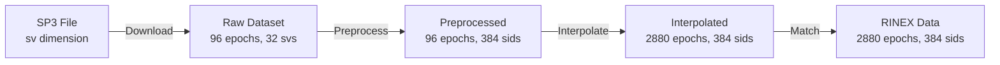
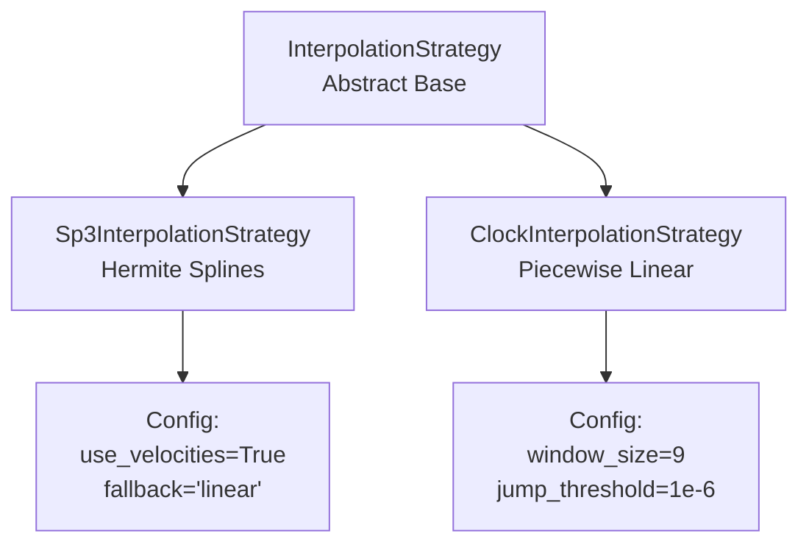
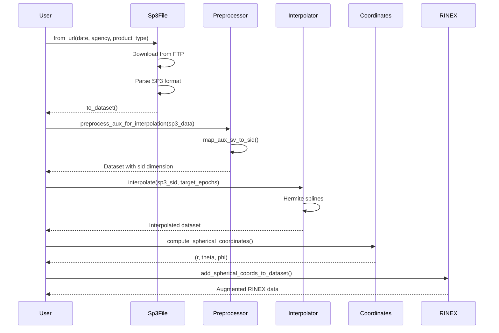

# canvod-auxiliary

## Purpose

The `canvod-auxiliary` package provides auxiliary data management for GNSS Transmissometry (GNSS-T) analysis. It handles downloading, parsing, preprocessing, and interpolating SP3 ephemerides and CLK clock corrections to augment RINEX observation data with precise satellite positions and timing information.

## The Dimension Alignment Problem

GNSS-T analysis requires combining two data sources with different indexing schemes:

**RINEX Observation Files:**
- High temporal resolution (30s, 15s, or sub-second)
- Signal-level indexing by Signal ID (sid): `"G01|L1|C"`
- Dimensions: `(epoch: 2880, sid: 384)`

**Auxiliary Files (SP3/CLK):**
- Low temporal resolution (15 min for SP3, 5 min for CLK)
- Satellite-level indexing by satellite vehicle (sv): `"G01"`
- Dimensions: `(epoch: 96, sv: 32)`

Combining these requires:
- Dimension conversion from sv (32 satellites) to sid (384 signal IDs)
- Temporal interpolation from 15 min to 30s sampling
- Coordinate system transformations (ECEF to geodetic to spherical)
- Scientifically appropriate interpolation methods per data type

## Preprocessing-First Architecture

Preprocessing must occur before interpolation. Each satellite transmits on approximately 12 signal IDs; interpolation operates per-signal, and RINEX data is already signal-indexed.



```python
# Correct ordering: preprocess then interpolate
sp3_data = sp3_file.to_dataset()  # {'epoch': 96, 'sv': 32}
sp3_sid = preprocess_aux_for_interpolation(sp3_data)  # {'epoch': 96, 'sid': 384}
sp3_interp = interpolator.interpolate(sp3_sid, target_epochs)  # {'epoch': 2880, 'sid': 384}
```

## Interpolation Strategies

Different data types require different interpolation methods based on the underlying physics:



**Ephemerides (SP3):** Hermite cubic splines exploit the smooth orbital motion and available velocity data to achieve sub-millimeter accuracy with C1 continuity.

**Clock corrections (CLK):** Piecewise linear interpolation accommodates discontinuities from satellite maneuvers and clock uploads, where no derivative information is available.

## Key Components

### File Handlers

- **Sp3File**: Reads SP3a/c/d formats; extracts positions (X, Y, Z) and velocities (VX, VY, VZ)
- **ClkFile**: Reads RINEX clock format; extracts satellite clock biases
- **ProductSpec**: Declarative configuration for product URLs, latency, and authentication

### Preprocessing Pipeline

```python
from canvod.auxiliary.preprocessing import prep_aux_ds

# Full 4-step pipeline: sv->sid, pad to global, normalize dtype, strip _FillValue
sp3_prep = prep_aux_ds(sp3_data)
```

### Position Classes

- **ECEFPosition**: Earth-Centered, Earth-Fixed Cartesian coordinates (X, Y, Z)
- **GeodeticPosition**: WGS84 latitude, longitude, altitude
- **Spherical coordinates**: (r, theta, phi) relative to receiver position

## Usage

### RINEX Data Augmentation

```python
from canvod.auxiliary import (
    Sp3File, preprocess_aux_for_interpolation,
    Sp3InterpolationStrategy, Sp3Config,
    compute_spherical_coordinates, ECEFPosition,
    add_spherical_coords_to_dataset,
)

rinex_ds = Rnxv3Obs("station.24o").to_ds()
target_epochs = rinex_ds.epoch.values

sp3_data = Sp3File.from_url(date, "CODE", "final").to_dataset()
sp3_sid = preprocess_aux_for_interpolation(sp3_data)

config = Sp3Config(use_velocities=True)
interpolator = Sp3InterpolationStrategy(config=config)
sp3_interp = interpolator.interpolate(sp3_sid, target_epochs)

receiver_pos = ECEFPosition.from_ds_metadata(rinex_ds)
r, theta, phi = compute_spherical_coordinates(
    sp3_interp['X'], sp3_interp['Y'], sp3_interp['Z'], receiver_pos
)

augmented_ds = add_spherical_coords_to_dataset(rinex_ds, r, theta, phi)
```

## Data Flow



