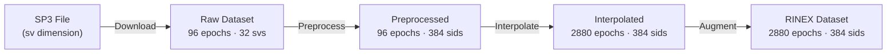

# canvod-auxiliary

## Purpose

The `canvod-auxiliary` package provides auxiliary data management for GNSS Transmissometry (GNSS-T) analysis. It handles downloading, parsing, preprocessing, and interpolating SP3 ephemerides and CLK clock corrections to augment RINEX observation data with precise satellite positions and timing information.

---

## The Dimension Alignment Problem

GNSS-T analysis requires combining two data sources with fundamentally different indexing:

<div class="grid" markdown>

!!! abstract "RINEX Observations"

    - High temporal resolution: 30 s, 15 s, or sub-second
    - Signal-level indexing by SID: `"G01|L1|C"`
    - Dimensions: `(epoch: 2880, sid: 384)`

!!! abstract "SP3 / CLK Auxiliary"

    - Low temporal resolution: 5–15 min
    - Satellite-level indexing by SV: `"G01"`
    - Dimensions: `(epoch: 96, sv: 32)`

</div>

Combining these requires:

1. **Dimension conversion** — sv (32 satellites) → sid (384 signal IDs)
2. **Temporal interpolation** — 15 min → 30 s sampling
3. **Coordinate transform** — ECEF → geodetic → spherical (r, θ, φ)
4. **Physically correct interpolation** per data type



---

## Interpolation Strategies

Different data types require different methods based on the underlying physics:

<div class="grid cards" markdown>

-   :fontawesome-solid-circle-nodes: &nbsp; **SP3 — Hermite Cubic Splines**

    ---

    Satellite orbital motion is smooth and predictable.
    Hermite splines exploit available velocity data for C1-continuity
    and sub-millimetre interpolation accuracy.

    ```python
    config = Sp3Config(use_velocities=True, fallback="linear")
    strategy = Sp3InterpolationStrategy(config=config)
    ```

-   :fontawesome-solid-clock: &nbsp; **CLK — Piecewise Linear**

    ---

    Clock corrections may have discontinuities from satellite maneuvers
    and uploads. No derivative information is available.
    Piecewise linear interpolation handles these jumps safely.

    ```python
    config = ClkConfig(window_size=9, jump_threshold=1e-6)
    strategy = ClockInterpolationStrategy(config=config)
    ```

</div>

---

## Key Components

<div class="grid cards" markdown>

-   :fontawesome-solid-file-arrow-down: &nbsp; **File Handlers**

    ---

    `Sp3File` — SP3a/c/d format: positions (X, Y, Z) + velocities (VX, VY, VZ)

    `ClkFile` — RINEX clock format: satellite clock biases

    `ProductSpec` — Declarative config for URLs, latency, and auth

-   :fontawesome-solid-arrows-rotate: &nbsp; **Preprocessing**

    ---

    `prep_aux_ds()` — Full 4-step pipeline: sv→sid mapping, pad to global SID,
    normalise dtype, strip `_FillValue`

    ```python
    sp3_sid = prep_aux_ds(sp3_raw)
    # {'epoch': 96, 'sid': 384}
    ```

-   :fontawesome-solid-location-crosshairs: &nbsp; **Coordinate Classes**

    ---

    `ECEFPosition` — Earth-Centred Earth-Fixed (X, Y, Z)

    `GeodeticPosition` — WGS84 latitude, longitude, altitude

    Spherical coordinates (r, θ, φ) relative to receiver position

-   :fontawesome-solid-cloud-arrow-down: &nbsp; **FTP Download**

    ---

    Primary: ESA/CODE FTP server

    Fallback: NASA CDDIS (requires Earthdata account)

    Per-DOY caching prevents redundant downloads

</div>

---

## Usage

=== "Full RINEX augmentation"

    ```python
    from canvod.auxiliary import (
        Sp3File, prep_aux_ds,
        Sp3InterpolationStrategy, Sp3Config,
        compute_spherical_coordinates, ECEFPosition,
        add_spherical_coords_to_dataset,
    )

    rinex_ds = Rnxv3Obs("station.25o").to_ds()
    target_epochs = rinex_ds.epoch.values

    # Download and parse
    sp3_raw = Sp3File.from_url(date, "CODE", "final").to_dataset()

    # Preprocess: sv → sid
    sp3_sid = prep_aux_ds(sp3_raw)

    # Interpolate to obs epochs
    interp = Sp3InterpolationStrategy(config=Sp3Config(use_velocities=True))
    sp3_at_obs = interp.interpolate(sp3_sid, target_epochs)

    # Compute geometry
    rx_pos = ECEFPosition.from_ds_metadata(rinex_ds)
    r, theta, phi = compute_spherical_coordinates(
        sp3_at_obs["X"], sp3_at_obs["Y"], sp3_at_obs["Z"], rx_pos
    )

    # Augment dataset
    augmented = add_spherical_coords_to_dataset(rinex_ds, r, theta, phi)
    ```

=== "Data flow"

    ```mermaid
    sequenceDiagram
        participant User
        participant Sp3File
        participant Preprocessor
        participant Interpolator
        participant Coordinates

        User->>Sp3File: from_url(date, agency, product_type)
        Sp3File->>Sp3File: FTP download + parse
        Sp3File-->>User: to_dataset() {epoch: 96, sv: 32}

        User->>Preprocessor: prep_aux_ds(sp3_raw)
        Preprocessor-->>User: {epoch: 96, sid: 384}

        User->>Interpolator: interpolate(sp3_sid, target_epochs)
        Interpolator->>Interpolator: Hermite splines
        Interpolator-->>User: {epoch: 2880, sid: 384}

        User->>Coordinates: compute_spherical_coordinates()
        Coordinates-->>User: (r, θ, φ) arrays

        User->>User: add_spherical_coords_to_dataset()
    ```
