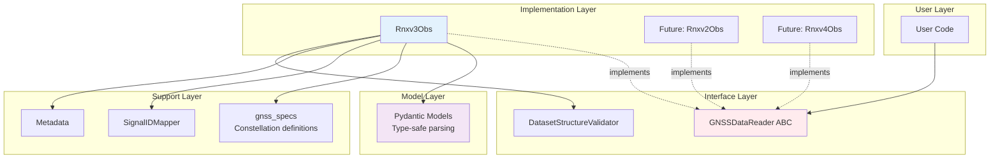
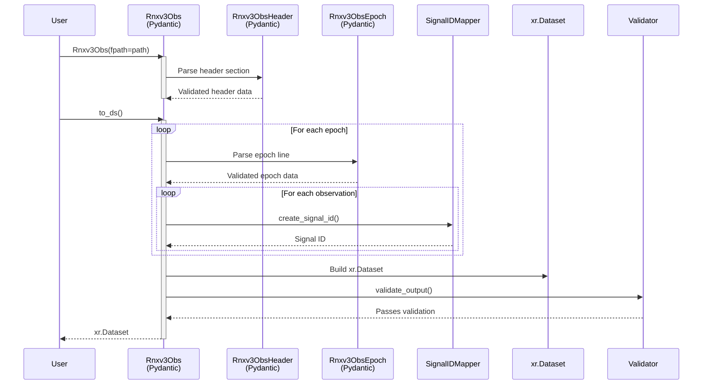

# Reader Architecture

This page describes the architectural principles behind canvod-readers, with particular focus on the Abstract Base Class (ABC) pattern used to ensure extensibility and consistency across reader implementations.

## The `GNSSDataReader` Abstract Base Class

The ABC pattern provides contract enforcement (all readers must implement required methods), type safety for static type checkers, explicit interface changes, mock implementations for testing downstream code, and self-documenting interface definitions.

The `GNSSDataReader` class is located in `canvod/readers/base.py`:

```python
from abc import ABC, abstractmethod
from pathlib import Path
import xarray as xr

class GNSSDataReader(ABC):
    """Abstract base for all GNSS data format readers.

    All readers must:
    1. Inherit from this class
    2. Implement all abstract methods
    3. Return xarray.Dataset that passes DatasetStructureValidator
    4. Provide file hash for deduplication
    """

    fpath: Path  # Provided by Pydantic BaseModel in concrete classes

    @property
    @abstractmethod
    def file_hash(self) -> str:
        """SHA256 hash of file for deduplication."""
        pass

    @abstractmethod
    def to_ds(
        self,
        keep_rnx_data_vars: list[str] | None = None,
        **kwargs
    ) -> xr.Dataset:
        """Convert data to xarray.Dataset."""
        pass

    @abstractmethod
    def iter_epochs(self):
        """Iterate over epochs in file."""
        pass

    @property
    @abstractmethod
    def start_time(self) -> datetime:
        """Start time of observations."""
        pass

    @property
    @abstractmethod
    def end_time(self) -> datetime:
        """End time of observations."""
        pass

    @property
    @abstractmethod
    def systems(self) -> list[str]:
        """GNSS systems in file."""
        pass

    @property
    @abstractmethod
    def num_epochs(self) -> int:
        """Number of epochs."""
        pass

    @property
    @abstractmethod
    def num_satellites(self) -> int:
        """Number of unique satellites."""
        pass

    def validate_output(
        self,
        dataset: xr.Dataset,
        required_vars: list[str] | None = None
    ) -> None:
        """Validate Dataset structure."""
        validator = DatasetStructureValidator(dataset=dataset)
        validator.validate_all(required_vars=required_vars)
```

### Contract Guarantees

Any implementation of `GNSSDataReader` guarantees the following:

1. **File Access**: The `fpath` attribute contains a Path to the data file.
2. **Hash Computation**: `file_hash` returns a deterministic identifier.
3. **Dataset Conversion**: `to_ds()` returns a validated xarray.Dataset.
4. **Iteration**: `iter_epochs()` yields epoch-by-epoch data.
5. **Metadata**: Properties provide time range, systems, and counts.
6. **Validation**: Output passes `DatasetStructureValidator`.

## Layered Architecture



### Layer Responsibilities

**User Layer** -- Instantiates readers, calls `to_ds()` and `iter_epochs()`, and operates on returned Datasets.

**Interface Layer (ABC)** -- Defines required methods, enforces contracts, and validates output structure.

**Implementation Layer (Concrete Readers)** -- Parses specific formats, implements abstract methods, and handles format-specific details.

**Support Layer** -- Provides constellation specifications (GPS, Galileo, etc.), Signal ID mapping, and metadata templates.

**Model Layer (Pydantic)** -- Supplies type-safe data models with automatic validation for parsing RINEX structure.

## Component Interactions

### Parsing Flow



Key interactions in this flow:

1. **Pydantic Models** parse and validate raw text.
2. **SignalIDMapper** converts observation codes to Signal IDs.
3. **Dataset Builder** constructs the xarray structure.
4. **Validator** ensures output meets structural requirements.

## Design Principles

### Early Validation with Pydantic

Errors discovered during analysis are expensive to diagnose and correct. Validation is therefore performed during parsing:

```python
from pydantic import BaseModel, field_validator

class Rnxv3ObsHeader(BaseModel):
    """RINEX v3 header with automatic validation."""

    rinex_version: float
    rinex_type: str

    @field_validator('rinex_version')
    def check_version(cls, v):
        if not (3.0 <= v < 4.0):
            raise ValueError(f"Expected RINEX v3, got {v}")
        return v

    @field_validator('rinex_type')
    def check_type(cls, v):
        if v != 'O':
            raise ValueError(f"Expected observation file, got {v}")
        return v
```

This approach catches errors at parse time with clear, structured error messages and provides type safety throughout the codebase.

### Immutability

Once created, readers and their outputs are immutable:

```python
class Rnxv3Obs(BaseModel):
    """Immutable after initialization."""

    model_config = ConfigDict(frozen=True)
    fpath: Path

    # Attempting to modify raises FrozenInstanceError
    # reader.fpath = new_path  # raises error
```

Immutability ensures predictable behavior, thread safety, and cacheable results.

### Separation of Format and Processing

Format-specific code is contained within the reader:

```python
# In Rnxv3Obs
def _parse_epoch_line(self, line: str) -> Rnxv3ObsEpochRecord:
    """RINEX v3 specific parsing."""
    ...
```

Generic processing is handled by shared helpers:

```python
# In gnss_specs
def create_signal_id(sv: str, obs_code: str) -> str:
    """Works for any format."""
    ...
```

### Explicit Configuration

Configuration is always explicit:

```python
# Explicit parameter specifying which variables to retain
ds = reader.to_ds(keep_rnx_data_vars=["SNR", "Phase"])
```

### Mandatory Validation

Every Dataset must be validated before it is returned:

```python
def to_ds(self, **kwargs) -> xr.Dataset:
    """Convert to Dataset."""
    ds = self._build_dataset(**kwargs)

    # Validation is mandatory, not optional
    self.validate_output(ds)

    return ds
```

## DatasetStructureValidator

The validator ensures all readers produce compatible output:

```python
class DatasetStructureValidator(BaseModel):
    """Validates xarray.Dataset structure."""

    dataset: xr.Dataset

    def validate_dimensions(self) -> None:
        """Check (epoch, sid) dimensions exist."""
        required = {"epoch", "sid"}
        missing = required - set(self.dataset.dims)
        if missing:
            raise ValueError(f"Missing dimensions: {missing}")

    def validate_coordinates(self) -> None:
        """Check all required coordinates with correct dtypes."""
        required_coords = {
            "epoch": "datetime64[ns]",
            "sid": "object",
            "sv": "object",
            "system": "object",
            "band": "object",
            "code": "object",
            "freq_center": "float32",
            "freq_min": "float32",
            "freq_max": "float32",
        }

        for coord, expected_dtype in required_coords.items():
            if coord not in self.dataset.coords:
                raise ValueError(f"Missing coordinate: {coord}")

            actual_dtype = str(self.dataset[coord].dtype)
            if expected_dtype not in actual_dtype:
                raise ValueError(
                    f"Wrong dtype for {coord}: "
                    f"expected {expected_dtype}, got {actual_dtype}"
                )

    def validate_data_variables(
        self, required_vars: list[str] | None = None
    ) -> None:
        """Check required data variables exist with correct structure."""
        if required_vars is None:
            required_vars = ["SNR", "Phase"]

        missing = set(required_vars) - set(self.dataset.data_vars)
        if missing:
            raise ValueError(f"Missing variables: {missing}")

        # All variables must be (epoch, sid)
        for var in self.dataset.data_vars:
            if self.dataset[var].dims != ("epoch", "sid"):
                raise ValueError(
                    f"{var} has wrong dimensions: "
                    f"expected (epoch, sid), got {self.dataset[var].dims}"
                )

    def validate_attributes(self) -> None:
        """Check required global attributes for storage."""
        required = {
            "Created",
            "Software",
            "Institution",
            "RINEX File Hash",  # For MyIcechunkStore deduplication
        }

        missing = required - set(self.dataset.attrs.keys())
        if missing:
            raise ValueError(f"Missing attributes: {missing}")
```

### Rationale for Structural Requirements

**Dimensions (epoch, sid)** -- Standardizes time series structure, enables efficient indexing and slicing, and maintains compatibility with xarray operations.

**Coordinates** -- `freq_*` coordinates are required for band overlap detection. `system`, `band`, and `code` enable constellation- and signal-level filtering. `sv` tracks individual satellites.

**Attributes** -- `"RINEX File Hash"` prevents duplicate ingestion in storage. Other metadata attributes support provenance tracking and reproducibility.

## ReaderFactory Pattern

The `ReaderFactory` provides automatic format detection:

```python
class ReaderFactory:
    """Factory for creating appropriate reader."""

    _readers: dict[str, type] = {}

    @classmethod
    def register(cls, format_name: str, reader_class: type) -> None:
        """Register a reader for a format."""
        if not issubclass(reader_class, GNSSDataReader):
            raise TypeError(f"{reader_class} must inherit GNSSDataReader")
        cls._readers[format_name] = reader_class

    @classmethod
    def create(cls, fpath: Path, **kwargs) -> GNSSDataReader:
        """Create appropriate reader for file."""
        format_name = cls._detect_format(fpath)

        if format_name not in cls._readers:
            raise ValueError(f"No reader for format: {format_name}")

        reader_class = cls._readers[format_name]
        return reader_class(fpath=fpath, **kwargs)

    @staticmethod
    def _detect_format(fpath: Path) -> str:
        """Detect format from file content."""
        with open(fpath, 'r') as f:
            first_line = f.readline()

        # RINEX version in columns 1-9
        version_str = first_line[:9].strip()
        version = float(version_str)

        if 3.0 <= version < 4.0:
            return 'rinex_v3'
        elif 2.0 <= version < 3.0:
            return 'rinex_v2'
        else:
            raise ValueError(f"Unsupported RINEX version: {version}")
```

Usage:

```python
# Register readers
ReaderFactory.register('rinex_v3', Rnxv3Obs)
ReaderFactory.register('rinex_v2', Rnxv2Obs)  # When implemented

# Automatic detection
reader = ReaderFactory.create("unknown_file.rnx")
# Returns Rnxv3Obs or Rnxv2Obs based on content
```

## Summary

The canvod-readers architecture is characterized by:

1. **Contract enforcement** through the ABC, ensuring consistent behavior across all readers.
2. **Type safety** via Pydantic, catching errors during parsing.
3. **Structural validation** through `DatasetStructureValidator`, ensuring downstream compatibility.
4. **Extensibility** through the ABC pattern, allowing new formats to be added without modifying existing code.
5. **Separation of concerns** between format-specific parsing, generic processing, and validation.
