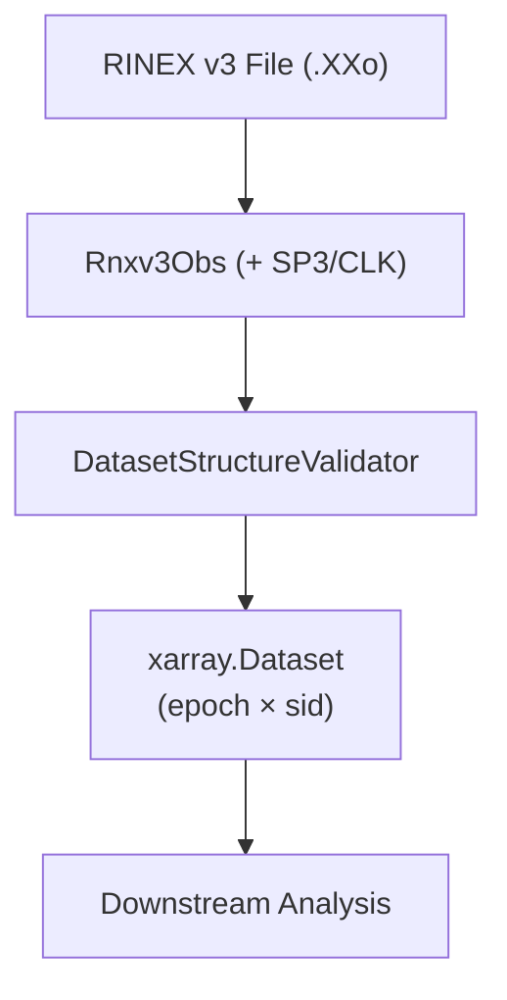

# canvod-readers

## Purpose

The `canvod-readers` package provides validated parsers for GNSS observation data. It transforms raw receiver files into analysis-ready xarray Datasets, serving as the data ingestion layer for GNSS Transmissometry (GNSS-T) analysis.

<div class="grid cards" markdown>

-   :fontawesome-solid-file-lines: &nbsp; **RINEX v3.04 — `Rnxv3Obs`**

    ---

    Text-based, all-GNSS standard format.
    Satellite geometry requires external SP3 + CLK precise ephemerides.

    [:octicons-arrow-right-24: RINEX format](rinex-format.md)

</div>

---

## Supported Formats

| Feature | `Rnxv3Obs` |
| ------- | ---------- |
| Format | Plain text |
| Extension | `.rnx`, `.XXo` |
| Satellite geometry (θ, φ) | SP3 + CLK download |
| `to_ds()` | ✓ |
| `iter_epochs()` | ✓ |

---

## Design

### Data flow



### Contract-Based Design

All readers implement the `GNSSDataReader` abstract base class:

```python
from abc import ABC, abstractmethod
import xarray as xr

class GNSSDataReader(ABC):
    """Base class for all GNSS data format readers."""

    @abstractmethod
    def to_ds(self, **kwargs) -> xr.Dataset:
        """Convert to xarray.Dataset (epoch × sid)."""

    @abstractmethod
    def iter_epochs(self):
        """Iterate through epochs."""

    @property
    @abstractmethod
    def file_hash(self) -> str:
        """SHA-256 hash for deduplication."""


```

[:octicons-arrow-right-24: Full architecture](architecture.md)

---

## Usage Examples

=== "RINEX — VOD pipeline"

    ```python
    from canvod.readers import Rnxv3Obs

    reader = Rnxv3Obs(fpath="station.25o")
    ds = reader.to_ds(keep_rnx_data_vars=["SNR"])

    # Filter L-band signals
    l_band = ds.where(ds.band.isin(["L1", "L2", "L5"]), drop=True)
    ```

=== "Multi-constellation analysis"

    ```python
    ds = reader.to_ds()

    for system in ["G", "R", "E", "C"]:
        sys_ds = ds.where(ds.system == system, drop=True)
        mean_snr = sys_ds.SNR.mean(dim=["epoch", "sid"])
        print(f"{system}: {mean_snr:.2f} dB")
    ```

=== "Time-series concat"

    ```python
    import xarray as xr
    from pathlib import Path

    datasets = [
        Rnxv3Obs(fpath=f).to_ds(keep_rnx_data_vars=["SNR"])
        for f in sorted(Path("/data/").glob("*.25o"))
    ]

    time_series = xr.concat(datasets, dim="epoch")
    ```

---

## Key Components

<div class="grid cards" markdown>

-   :fontawesome-solid-earth-europe: &nbsp; **GNSS Specifications**

    ---

    `gnss_specs` provides constellation definitions for GPS, GALILEO,
    GLONASS, BeiDou, QZSS, and SBAS including band mappings and
    centre frequencies.

    ```python
    from canvod.readers.gnss_specs import GPS
    gps = GPS()
    gps.BANDS  # {'1': 'L1', '2': 'L2', '5': 'L5'}
    ```

-   :fontawesome-solid-id-badge: &nbsp; **Signal ID Mapper**

    ---

    `SignalIDMapper` converts raw observation codes to canonical
    `SV|Band|Code` signal IDs used across all datasets.

    ```python
    mapper = SignalIDMapper()
    sid = mapper.create_signal_id("G01", "G01|S1C")
    # → "G01|L1|C"
    ```

-   :fontawesome-solid-circle-check: &nbsp; **DatasetStructureValidator**

    ---

    Every dataset produced by any reader must pass structural validation
    before it is returned. Checks dimensions, coordinate dtypes, required
    variables, and global attributes.

    ```python
    validator = DatasetStructureValidator(dataset=ds)
    validator.validate_all()  # raises ValueError if invalid
    ```

</div>

---

## Optimization

!!! tip "Memory"

    Use `keep_rnx_data_vars=["SNR"]` to load only what you need.
    Full RINEX with phase + Doppler uses ~4× more memory.

!!! tip "Batch processing"

    For many files, use `ProcessPoolExecutor`. Each reader is fully
    picklable and stateless after construction.

!!! tip "Storage"

    After processing, write to Icechunk via `canvod-store` for
    compressed, versioned storage with O(1) epoch lookups.
