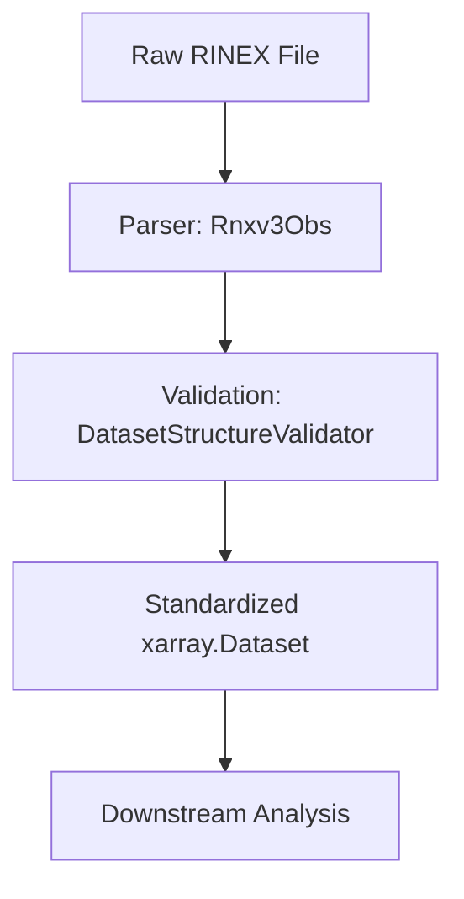
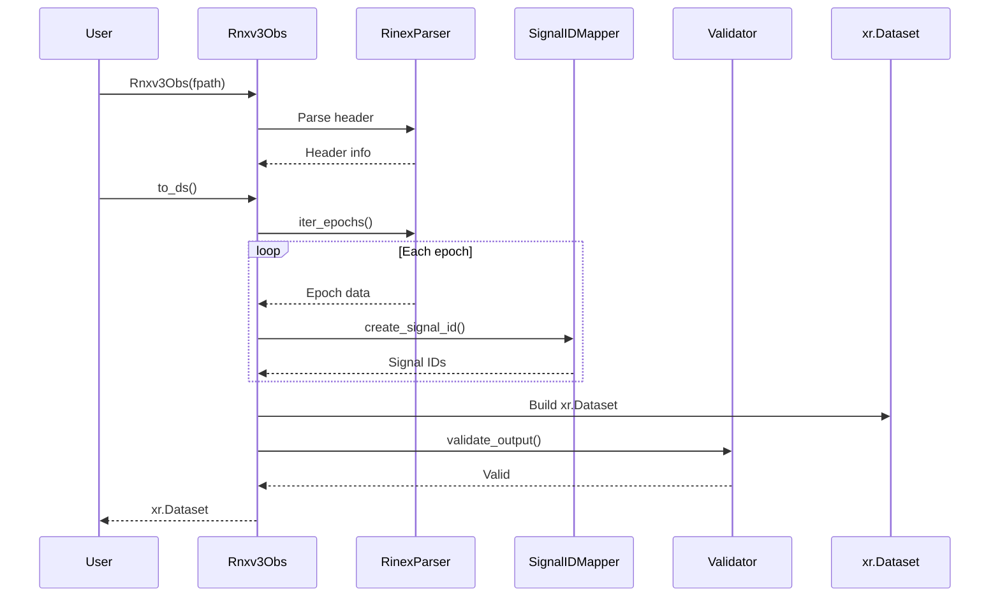

# canvod-readers

## Purpose

The `canvod-readers` package provides validated parsers for GNSS observation data. It transforms raw RINEX files into analysis-ready xarray Datasets, serving as the data ingestion layer for GNSS Transmissometry (GNSS-T) analysis.

## Supported Input Formats

GNSS data is distributed in various formats with complex structures:

- Complex headers containing station metadata, observation types, and system information
- Multiple constellations: GPS, GLONASS, Galileo, BeiDou, QZSS, IRNSS, SBAS
- Variable frequency bands: L1, L2, L5, E1, E5a, E5b, B1, B2, B3, G1, G2
- Multiple observable types: SNR, Phase, Pseudorange, Doppler
- Irregular data: missing epochs, incomplete observations, varying sampling rates

The package addresses these complexities by providing:

- Standardized output format (xarray.Dataset)
- Automatic validation (completeness checks, dtype verification)
- Memory-efficient parsing (lazy loading, epoch-by-epoch iteration)
- Signal disambiguation through unique Signal IDs
- Extensibility via the `GNSSDataReader` abstract base class

## Design

### Separation of Concerns



Each component has a single responsibility:

- **Parser (`Rnxv3Obs`)**: Reads RINEX files and extracts observations
- **Validator (`DatasetStructureValidator`)**: Ensures output meets structural requirements
- **Dataset**: Standard format consumed by downstream packages

### Contract-Based Design

All readers implement the `GNSSDataReader` abstract base class:

```python
from abc import ABC, abstractmethod

class GNSSDataReader(ABC):
    """Base class for all GNSS data format readers."""

    @abstractmethod
    def to_ds(self, **kwargs) -> xr.Dataset:
        """Convert to xarray.Dataset."""

    @abstractmethod
    def iter_epochs(self):
        """Iterate through epochs."""

    @property
    @abstractmethod
    def file_hash(self) -> str:
        """Compute file hash for deduplication."""
```

This contract ensures all readers produce compatible output, allowing downstream code to operate independently of the specific reader implementation.

### Validation

Every Dataset produced by any reader must pass validation:

```python
validator = DatasetStructureValidator(dataset=ds)
validator.validate_all()  # Raises ValueError if invalid
```

Validation checks include:

- Required dimensions: `(epoch, sid)`
- Required coordinates: `epoch`, `sid`, `sv`, `system`, `band`, `code`, `freq_*`
- Correct dtypes: `float32` for frequencies, `datetime64[ns]` for epoch
- Required attributes: `"Created"`, `"RINEX File Hash"`
- Minimum data variables: `SNR`, `Phase`

## Usage Examples

### VOD Analysis Pipeline

```python
reader = Rnxv3Obs(fpath="station.24o")
ds = reader.to_ds(keep_rnx_data_vars=["SNR"])

# Filter L-band signals
l_band = ds.where(ds.band.isin(['L1', 'L2', 'L5']), drop=True)

# Pass to VOD calculator
from canvod.vod import VODCalculator
vod = VODCalculator(l_band).compute()
```

### Multi-Constellation Analysis

```python
ds = reader.to_ds()

for system in ['G', 'R', 'E', 'C']:
    system_ds = ds.where(ds.system == system, drop=True)
    mean_snr = system_ds.SNR.mean(dim=['epoch', 'sid'])
    print(f"{system}: {mean_snr:.2f} dB")
```

### Time Series Processing

```python
from pathlib import Path

rinex_dir = Path("/data/station/2024/")
datasets = []

for rinex_file in sorted(rinex_dir.glob("*.24o")):
    reader = Rnxv3Obs(fpath=rinex_file)
    ds = reader.to_ds(keep_rnx_data_vars=["SNR"])
    datasets.append(ds)

time_series = xr.concat(datasets, dim='epoch')
```

### Quality Control

```python
ds = reader.to_ds()

# Find satellites with low SNR
low_snr_sats = ds.where(ds.SNR < 30, drop=True).sv.values
print(f"Low SNR satellites: {set(low_snr_sats)}")

# Check epoch completeness
expected_epochs = 2880  # 30s sampling, 24 hours
actual_epochs = len(ds.epoch)
completeness = (actual_epochs / expected_epochs) * 100
print(f"Epoch completeness: {completeness:.1f}%")
```

## Key Components

### Readers

Currently implemented:

- `Rnxv3Obs`: RINEX v3.04 observation files

Planned:

- `Rnxv2Obs`: RINEX v2.11 observation files
- `Rnxv4Obs`: RINEX v4.00 observation files

### GNSS Specifications

The `gnss_specs` module provides constellation-specific information:

```python
from canvod.readers.gnss_specs import GPS, GALILEO, SignalIDMapper

gps = GPS()
print(gps.BANDS)  # {'1': 'L1', '2': 'L2', '5': 'L5'}

mapper = SignalIDMapper()
sid = mapper.create_signal_id("G01", "G01|S1C")
print(sid)  # "G01|L1|C"
```

### Validators

The `DatasetStructureValidator` ensures data quality and compatibility:

```python
from canvod.readers.base import DatasetStructureValidator

validator = DatasetStructureValidator(dataset=ds)
validator.validate_dimensions()      # Check (epoch, sid)
validator.validate_coordinates()     # Check required coords
validator.validate_data_variables()  # Check SNR, Phase exist
validator.validate_attributes()      # Check metadata
```

## Data Flow



## Optimization Guidelines

- **Filter early**: Use `keep_rnx_data_vars` to limit data variables loaded into memory.
- **System filtering**: Process one constellation at a time for large files.
- **Batch processing**: Use multiprocessing for multiple files.
- **Storage**: Save to Zarr/NetCDF for faster subsequent access.
