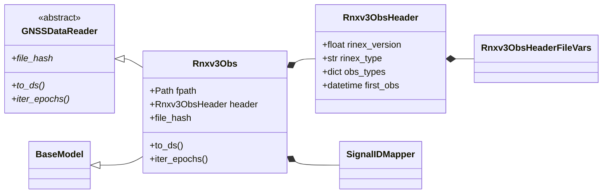

# RINEX v3.04 Parsing

`Rnxv3Obs` implements a full RINEX v3.04 observation file parser — from raw text to a validated `xarray.Dataset` in a single `to_ds()` call.

---

## File Structure

A RINEX v3 observation file has two sections separated by `END OF HEADER`:

```
+──────────────────────────────────────────────────+
│  HEADER SECTION                                   │
│  RINEX VERSION / TYPE          → 3.04, O          │
│  SYS / # / OBS TYPES           → G: S1C S2W …    │
│  TIME OF FIRST OBS             → 2024 001         │
│  INTERVAL                      → 30.000           │
+──────────────────────────────────────────────────+
│  DATA SECTION                                     │
│  > 2024 01 01 00 00 00.0000000  0  18             │  ← epoch marker
│    G01   41.050  …   22.123456  …                 │  ← observations
│    G03   40.112  …   21.987654  …                 │
│  > 2024 01 01 00 00 30.0000000  0  17             │
│    …                                              │
+──────────────────────────────────────────────────+
```

Supported systems: GPS (G), GLONASS (R), Galileo (E), BeiDou (C), QZSS (J), IRNSS (I), SBAS (S).

---

## Class Hierarchy



---

## Parsing Pipeline

### Step 1 — Initialization

```python
from pathlib import Path
from canvod.readers import Rnxv3Obs

reader = Rnxv3Obs(fpath=Path("station.24o"))
```

What happens on construction:

1. Pydantic validates that `fpath` exists and is readable.
2. The header section is parsed into `Rnxv3ObsHeader`.
3. RINEX version (3.x) and file type (`O`) are validated.
4. Observation type table (`SYS / # / OBS TYPES`) is extracted.

!!! tip "Lazy data section"
    The data section is **not** read at construction time.
    Only the header (~50 lines) is loaded — making instantiation fast
    even for multi-GB files.

### Step 2 — Epoch Iteration

```python
for epoch in reader.iter_epochs():
    print(epoch.timestamp, epoch.num_satellites)
```

The generator scans forward from `END OF HEADER`, yielding one `Rnxv3ObsEpochRecord` per `>` epoch marker. Memory usage is bounded to one epoch at a time.

### Step 3 — Dataset Construction

```python
ds = reader.to_ds(keep_rnx_data_vars=["SNR", "Phase"])
```

The full pipeline:

=== "Collect + Index"

    ```python
    all_epochs = list(self.iter_epochs())

    # Build the full SID index (sorted for reproducibility)
    mapper = SignalIDMapper()
    all_sids = sorted({
        mapper.create_signal_id(obs.sv, obs.code)
        for epoch in all_epochs
        for obs in epoch.observations
    })
    ```

=== "Allocate + Fill"

    ```python
    # Pre-allocate — avoids repeated memory reallocation
    snr_data = np.full((len(epochs), len(sids)), np.nan, dtype=np.float32)
    sid_to_idx = {sid: i for i, sid in enumerate(all_sids)}

    for i, epoch in enumerate(all_epochs):
        for obs in epoch.observations:
            sid = mapper.create_signal_id(obs.sv, obs.code)
            snr_data[i, sid_to_idx[sid]] = obs.snr
    ```

=== "Build Coordinates"

    ```python
    sv_arr     = np.array([sid.split('|')[0] for sid in all_sids])
    system_arr = np.array([sid[0]            for sid in all_sids])
    band_arr   = np.array([sid.split('|')[1] for sid in all_sids])
    code_arr   = np.array([sid.split('|')[2] for sid in all_sids])

    freq_center = np.array([mapper.get_band_frequency(sid.split('|')[1])
                            for sid in all_sids], dtype=np.float64)
    bandwidth   = np.array([mapper.get_band_bandwidth(sid.split('|')[1])
                            for sid in all_sids], dtype=np.float64)
    ```

=== "Validate + Return"

    ```python
    ds = xr.Dataset(
        data_vars={"SNR": (("epoch", "sid"), snr_data, SNR_METADATA), ...},
        coords={"epoch": ..., "sid": ..., "sv": ..., ...},
        attrs={
            "Created":         datetime.now().isoformat(),
            "Software":        f"canvod-readers {__version__}",
            "Institution":     "...",
            "RINEX File Hash": self.file_hash,
        },
    )

    self.validate_output(ds, required_vars=keep_rnx_data_vars)
    return ds
    ```

---

## Pydantic Data Models

### Header Model

```python
from pydantic import BaseModel, field_validator

class Rnxv3ObsHeader(BaseModel):
    rinex_version: float
    rinex_type:    str
    obs_types:     dict[str, list[str]]   # system → observation codes
    interval:      float | None = None
    first_obs:     datetime | None = None

    @field_validator("rinex_version")
    def check_version(cls, v):
        if not (3.0 <= v < 4.0):
            raise ValueError(f"Expected RINEX v3, got {v}")
        return v

    @field_validator("rinex_type")
    def check_type(cls, v):
        if v != "O":
            raise ValueError(f"Expected observation file, got {v}")
        return v
```

### Epoch Record

```python
class Rnxv3ObsEpochRecord(BaseModel):
    epoch_flag:     int       # 0 = OK, 2 = power failure, …
    timestamp:      datetime
    num_satellites: int
    satellites:     list[Satellite] = []

    @field_validator("epoch_flag")
    def check_flag(cls, v):
        if not (0 <= v <= 6):
            raise ValueError(f"Invalid epoch flag: {v}")
        return v
```

### Observation and Satellite

```python
class Observation(BaseModel):
    value: float
    lli:   int | None = None   # Loss of Lock Indicator (0–9)
    ssi:   int | None = None   # Signal Strength Indicator (0–9)

class Satellite(BaseModel):
    sv:           str                      # e.g. "G01"
    observations: dict[str, Observation]   # obs_code → Observation
```

---

## Signal ID Mapping

RINEX observation codes (`S1C`, `L2W`, `C5Q`, …) are mapped to the canonical Signal ID format `SV|BAND|CODE`:

| RINEX code | System | Band | Code | Signal ID |
|------------|--------|------|------|-----------|
| `S1C` on `G01` | GPS | L1 | C | `G01\|L1\|C` |
| `S5Q` on `E08` | Galileo | E5a | Q | `E08\|E5a\|Q` |
| `S2P` on `R05` | GLONASS | G2 | P | `R05\|G2\|P` |

### Constellation Band Mapping

```python
SYSTEM_BANDS = {
    "G": {"1": "L1", "2": "L2", "5": "L5"},
    "R": {"1": "G1", "2": "G2", "3": "G3"},
    "E": {"1": "E1", "5": "E5a", "7": "E5b", "6": "E6"},
    "C": {"2": "B1I", "1": "B1C", "5": "B2a", "7": "B2b", "6": "B3I"},
}
```

---

## Performance Notes

<div class="grid" markdown>

!!! tip "Lazy iteration"
    `iter_epochs()` is a generator — the file is never loaded entirely into
    memory. One epoch is held at a time.

!!! tip "Pre-allocated arrays"
    `to_ds()` pre-allocates NumPy arrays with `np.full(..., np.nan)` before
    filling, avoiding repeated memory reallocation during the fill loop.

</div>

---

## Error Handling

```python
from pydantic import ValidationError
from canvod.readers.gnss_specs.exceptions import (
    CorruptedFileError,
    MissingEpochError,
    IncompleteEpochError,
)

# Construction errors — header is invalid
try:
    reader = Rnxv3Obs(fpath=path)
except ValidationError as e:
    print(f"Invalid RINEX header: {e}")

# Runtime errors — data section is malformed
try:
    ds = reader.to_ds()
except CorruptedFileError:
    print("File is corrupted or truncated")
except IncompleteEpochError:
    print("An epoch has fewer satellites than declared")
```

!!! info "Exception hierarchy"
    All reader-specific exceptions inherit from `RinexError`, allowing
    broad `except RinexError` handling when needed alongside specific
    sub-class recovery.
