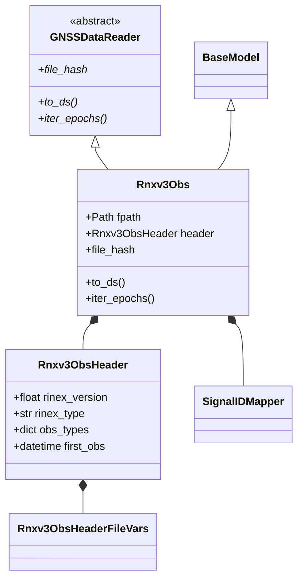

# RINEX v3.04 Parsing

The `Rnxv3Obs` class implements a RINEX v3.04 observation file reader. This page documents the internal parsing pipeline, data models, and performance characteristics.

## Format Overview

RINEX (Receiver Independent Exchange Format) is the standard exchange format for GNSS observations. Version 3.04 supports:

- Multiple GNSS constellations: GPS, GLONASS, Galileo, BeiDou, QZSS, IRNSS, SBAS
- Observation types: SNR, Phase, Pseudorange, Doppler, LLI, SSI
- Hatanaka compression for compact representation
- Extended metadata: antenna, receiver, and station information

### File Structure

```
RINEX v3.04 Observation File

+----------------------------------+
|         HEADER SECTION           |
|  - Version, Type                 |
|  - Antenna, Receiver info        |
|  - Observation types             |
|  - Time of first obs             |
|  - Interval, Number of obs       |
+----------------------------------+
+----------------------------------+
|         DATA SECTION             |
|  Epoch 1: 2024-01-01 00:00:00   |
|    G01  observations             |
|    G02  observations             |
|    ...                           |
|  Epoch 2: 2024-01-01 00:00:30   |
|    G01  observations             |
|    ...                           |
+----------------------------------+
```

## Implementation

### Class Hierarchy



### Core Components

**`Rnxv3Obs`** -- Main reader class. Implements the `GNSSDataReader` ABC, orchestrates parsing, and builds xarray Datasets.

**`Rnxv3ObsHeader`** -- Header parser. A Pydantic model for the header section that validates header format and extracts metadata.

**`Rnxv3ObsEpochRecord`** -- Epoch parser. Parses epoch lines, extracts timestamps and satellite counts, and validates epoch flags.

**`Observation`** -- Individual observation. Represents a single measurement and stores the value along with LLI and SSI flags.

## Parsing Pipeline

### Step 1: Initialization

```python
from pathlib import Path
from canvod.readers import Rnxv3Obs

reader = Rnxv3Obs(fpath=Path("station.24o"))
```

During initialization, the following operations are performed:

1. Pydantic validates that `fpath` exists and is readable.
2. The header section is parsed immediately.
3. The header is validated (RINEX version, file type, observation types).
4. The data section position is cached for iteration.

```python
# Internal initialization
class Rnxv3Obs(BaseModel, GNSSDataReader):
    fpath: Path
    header: Rnxv3ObsHeader | None = None

    @model_validator(mode='after')
    def parse_header(self):
        """Parse header on initialization."""
        with open(self.fpath, 'r') as f:
            header_lines = []
            for line in f:
                header_lines.append(line)
                if "END OF HEADER" in line:
                    break

        self.header = Rnxv3ObsHeader.from_lines(header_lines)
        return self
```

### Step 2: Epoch Iteration

```python
for epoch in reader.iter_epochs():
    print(epoch.timestamp, epoch.num_satellites)
```

Internal flow:

```python
def iter_epochs(self) -> Generator[Rnxv3ObsEpochRecord, None, None]:
    """Lazily iterate through epochs."""
    with open(self.fpath, 'r') as f:
        # Skip to end of header
        for line in f:
            if "END OF HEADER" in line:
                break

        # Read data section
        current_epoch = None
        for line in f:
            if line.startswith('>'):  # Epoch marker
                if current_epoch:
                    yield current_epoch
                current_epoch = Rnxv3ObsEpochRecord.from_line(line)
            else:
                # Observation line
                current_epoch.add_observation(line)
```

### Step 3: Dataset Construction

```python
ds = reader.to_ds(keep_rnx_data_vars=["SNR", "Phase"])
```

Complete implementation:

```python
def to_ds(
    self,
    keep_rnx_data_vars: list[str] | None = None,
    **kwargs
) -> xr.Dataset:
    """Convert RINEX to xarray.Dataset.

    Parameters
    ----------
    keep_rnx_data_vars : list of str, optional
        Variables to include. If None, includes all.

    Returns
    -------
    xr.Dataset
        Validated dataset with standardized structure.
    """
    # 1. Collect all observations
    epochs_data = []
    for epoch in self.iter_epochs():
        epochs_data.append(epoch)

    # 2. Build Signal ID index
    signal_mapper = SignalIDMapper()
    all_sids = set()
    for epoch in epochs_data:
        for sat in epoch.satellites:
            for obs_code in sat.observations:
                sid = signal_mapper.create_signal_id(
                    sat.sv, f"{sat.sv}|{obs_code}"
                )
                all_sids.add(sid)

    sids = sorted(all_sids)

    # 3. Create coordinate arrays
    epochs = [e.timestamp for e in epochs_data]

    # Extract SV, system, band, code from SIDs
    sv_arr = np.array([sid.split('|')[0] for sid in sids])
    band_arr = np.array([sid.split('|')[1] for sid in sids])
    code_arr = np.array([sid.split('|')[2] for sid in sids])
    system_arr = np.array([sid[0] for sid in sids])

    # Get frequencies
    freq_center = np.array([
        signal_mapper.get_band_frequency(sid.split('|')[1])
        for sid in sids
    ], dtype=np.float64)

    bandwidth = np.array([
        signal_mapper.get_band_bandwidth(sid.split('|')[1])
        for sid in sids
    ], dtype=np.float64)

    freq_min = freq_center - (bandwidth / 2.0)
    freq_max = freq_center + (bandwidth / 2.0)

    # 4. Build data arrays
    data_vars = {}
    if keep_rnx_data_vars is None or "SNR" in keep_rnx_data_vars:
        snr_data = np.full((len(epochs), len(sids)), np.nan, dtype=np.float32)
        # Fill with observations...
        data_vars["SNR"] = (("epoch", "sid"), snr_data)

    # Similar for Phase, Pseudorange, Doppler...

    # 5. Create Dataset
    ds = xr.Dataset(
        data_vars=data_vars,
        coords={
            "epoch": ("epoch", epochs),
            "sid": ("sid", sids),
            "sv": ("sid", sv_arr),
            "system": ("sid", system_arr),
            "band": ("sid", band_arr),
            "code": ("sid", code_arr),
            "freq_center": ("sid", freq_center),
            "freq_min": ("sid", freq_min),
            "freq_max": ("sid", freq_max),
        },
        attrs={
            "Created": datetime.now().isoformat(),
            "Software": f"canvod-readers {__version__}",
            "RINEX File Hash": self.file_hash,
            # ... more attributes
        }
    )

    # 6. Validate before returning
    self.validate_output(ds, required_vars=keep_rnx_data_vars)

    return ds
```

## Pydantic Data Models

Pydantic models are used throughout the parsing pipeline to enforce type safety and validate data at parse time rather than during downstream analysis. This approach ensures that malformed input is detected immediately, with structured error messages indicating the source of the problem.

### Header Model

The `Rnxv3ObsHeader` model validates all header fields according to the RINEX v3.04 specification:

```python
from pydantic import BaseModel, field_validator
from datetime import datetime

class Rnxv3ObsHeader(BaseModel):
    """RINEX v3 header with automatic validation.

    Parses and validates all header fields according to
    RINEX v3.04 specification.
    """

    # Required fields
    rinex_version: float
    rinex_type: str
    sat_system: str | None = None

    # Program information
    pgm: str | None = None
    run_by: str | None = None
    date: str | None = None

    # Station information
    marker_name: str | None = None
    marker_number: str | None = None
    marker_type: str | None = None
    observer: str | None = None
    agency: str | None = None

    # Receiver information
    rec_number: str | None = None
    rec_type: str | None = None
    rec_vers: str | None = None

    # Antenna information
    ant_number: str | None = None
    ant_type: str | None = None
    approx_position_xyz: tuple[float, float, float] | None = None
    antenna_delta_hen: tuple[float, float, float] | None = None

    # Observation information
    obs_types: dict[str, list[str]]  # system -> observation types
    signal_strength_unit: str | None = None
    interval: float | None = None
    time_of_first_obs: datetime | None = None
    time_of_last_obs: datetime | None = None

    # Validators
    @field_validator('rinex_version')
    def check_rinex_version(cls, v):
        """Ensure RINEX v3.x."""
        if not (3.0 <= v < 4.0):
            raise ValueError(f"Expected RINEX v3, got {v}")
        return v

    @field_validator('rinex_type')
    def check_file_type(cls, v):
        """Ensure observation file."""
        if v != 'O':
            raise ValueError(f"Expected observation file (O), got {v}")
        return v

    @field_validator('obs_types')
    def check_obs_types(cls, v):
        """Validate observation types."""
        if not v:
            raise ValueError("No observation types defined")

        valid_types = {'C', 'L', 'D', 'S'}
        for system, obs_list in v.items():
            for obs in obs_list:
                if obs[0] not in valid_types:
                    raise ValueError(f"Invalid observation type: {obs}")
        return v

    @classmethod
    def from_lines(cls, lines: list[str]) -> 'Rnxv3ObsHeader':
        """Parse header from lines."""
        data = {}

        for line in lines:
            label = line[60:80].strip()

            if label == "RINEX VERSION / TYPE":
                data['rinex_version'] = float(line[0:9])
                data['rinex_type'] = line[20]
                data['sat_system'] = line[40] if line[40] != ' ' else None

            elif label == "PGM / RUN BY / DATE":
                data['pgm'] = line[0:20].strip()
                data['run_by'] = line[20:40].strip()
                data['date'] = line[40:60].strip()

            elif label == "MARKER NAME":
                data['marker_name'] = line[0:60].strip()

            # ... parse all other fields

            elif label == "SYS / # / OBS TYPES":
                system = line[0]
                num_obs = int(line[3:6])
                obs_types = []

                # Parse observation types (may span multiple lines)
                start = 7
                for i in range(num_obs):
                    if start >= 60:  # Continuation line
                        # Read next line
                        pass
                    obs_types.append(line[start:start+3].strip())
                    start += 4

                if 'obs_types' not in data:
                    data['obs_types'] = {}
                data['obs_types'][system] = obs_types

        return cls(**data)
```

### Epoch Record Model

```python
class Rnxv3ObsEpochRecord(BaseModel):
    """Single epoch with observations."""

    epoch_flag: int  # 0-6
    timestamp: datetime
    num_satellites: int
    satellites: list[Satellite] = []

    @field_validator('epoch_flag')
    def check_epoch_flag(cls, v):
        """Validate epoch flag."""
        if not (0 <= v <= 6):
            raise ValueError(f"Invalid epoch flag: {v}")
        return v

    @classmethod
    def from_line(cls, line: str) -> 'Rnxv3ObsEpochRecord':
        """Parse epoch line.

        Format: > YYYY MM DD HH MM SS.SSSSSSS  F NS
        """
        if not line.startswith('>'):
            raise ValueError("Epoch line must start with '>'")

        # Extract fields
        year = int(line[2:6])
        month = int(line[7:9])
        day = int(line[10:12])
        hour = int(line[13:15])
        minute = int(line[16:18])
        second = float(line[19:30])

        epoch_flag = int(line[31])
        num_satellites = int(line[33:36])

        timestamp = datetime(
            year, month, day, hour, minute,
            int(second), int((second % 1) * 1e6)
        )

        return cls(
            epoch_flag=epoch_flag,
            timestamp=timestamp,
            num_satellites=num_satellites
        )
```

### Satellite and Observation Models

```python
class Observation(BaseModel):
    """Single observation value."""

    value: float
    lli: int | None = None  # Loss of lock indicator
    ssi: int | None = None  # Signal strength indicator

    @field_validator('lli')
    def check_lli(cls, v):
        if v is not None and not (0 <= v <= 9):
            raise ValueError(f"LLI must be 0-9, got {v}")
        return v

    @field_validator('ssi')
    def check_ssi(cls, v):
        if v is not None and not (0 <= v <= 9):
            raise ValueError(f"SSI must be 0-9, got {v}")
        return v


class Satellite(BaseModel):
    """Satellite with observations."""

    sv: str  # e.g., "G01", "E05"
    observations: dict[str, Observation]  # obs_code -> Observation

    @field_validator('sv')
    def check_sv_format(cls, v):
        """Validate SV format."""
        if len(v) != 3:
            raise ValueError(f"SV must be 3 characters, got {v}")
        if v[0] not in 'GRECJIS':
            raise ValueError(f"Invalid system: {v[0]}")
        if not v[1:].isdigit():
            raise ValueError(f"Invalid PRN: {v[1:]}")
        return v
```

## Signal ID Mapping

The `SignalIDMapper` converts RINEX observation codes to unique Signal IDs:

```python
class SignalIDMapper:
    """Map observation codes to Signal IDs."""

    def create_signal_id(self, sv: str, obs_code: str) -> str:
        """Create Signal ID from SV and observation code.

        Parameters
        ----------
        sv : str
            Satellite vehicle (e.g., "G01")
        obs_code : str
            Observation code (e.g., "G01|S1C")

        Returns
        -------
        str
            Signal ID in format "SV|BAND|CODE"

        Examples
        --------
        >>> mapper = SignalIDMapper()
        >>> mapper.create_signal_id("G01", "G01|S1C")
        'G01|L1|C'
        """
        sv, observation_code = obs_code.split('|')
        system = sv[0]

        # Special case: X1 auxiliary observations
        if observation_code == 'X1':
            return f"{sv}|X1|X"

        # Standard: TYPE + BAND + CODE
        # e.g., "S1C" -> Type=S, Band=1, Code=C
        obs_type = observation_code[0]  # S, C, L, D
        band_num = observation_code[1]  # 1, 2, 5, etc.
        code = observation_code[2]      # C, P, W, etc.

        # Map band number to band name
        band_name = self.SYSTEM_BANDS[system].get(
            band_num, f'UnknownBand{band_num}'
        )

        return f"{sv}|{band_name}|{code}"
```

### Constellation-Specific Band Mapping

Different GNSS constellations use different band numbering schemes. The mapping table is as follows:

```python
# GPS: 1 -> L1, 2 -> L2, 5 -> L5
SYSTEM_BANDS = {
    'G': {'1': 'L1', '2': 'L2', '5': 'L5'},
    'R': {'1': 'G1', '2': 'G2', '3': 'G3'},  # GLONASS
    'E': {'1': 'E1', '5': 'E5a', '7': 'E5b', '6': 'E6'},  # Galileo
    'C': {'2': 'B1I', '1': 'B1C', '5': 'B2a', '7': 'B2b', '6': 'B3I'},  # BeiDou
}
```

## Performance Optimizations

### Lazy Iteration

The file is not loaded entirely into memory. Instead, epochs are yielded one at a time:

```python
def iter_epochs(self):
    """Generator - yields one epoch at a time."""
    with open(self.fpath, 'r') as f:
        # Skip header
        for line in f:
            if "END OF HEADER" in line:
                break

        # Yield epochs as parsed
        for epoch in self._parse_data_section(f):
            yield epoch
```

### Pre-allocated Arrays

For `to_ds()`, arrays are pre-allocated rather than grown dynamically:

```python
# Pre-allocate with NaN fill
snr_data = np.full(
    (len(epochs), len(sids)),
    np.nan,
    dtype=np.float32
)

# Then fill in-place
for i, epoch in enumerate(epochs_data):
    for sid, value in epoch.get_observations("SNR"):
        j = sid_to_index[sid]
        snr_data[i, j] = value
```

This avoids repeated memory allocations that would occur with dynamically growing lists.

### Vectorized Operations

NumPy vectorization is used for coordinate creation:

```python
# Vectorized
sv_arr = np.array([sid.split('|')[0] for sid in sids])
system_arr = np.char.array(sv_arr)[:, 0]
```

## Error Handling

### Validation at Parse Time

```python
try:
    reader = Rnxv3Obs(fpath=path)
except ValidationError as e:
    # Pydantic validation failed
    print(f"Invalid RINEX file: {e}")

try:
    ds = reader.to_ds()
except ValueError as e:
    # Dataset validation failed
    print(f"Invalid dataset structure: {e}")
```

### Specific Exception Types

The `canvod.readers.gnss_specs.exceptions` module defines a hierarchy of exceptions for fine-grained error handling:

```python
from canvod.readers.gnss_specs.exceptions import (
    CorruptedFileError,
    MissingEpochError,
    IncompleteEpochError,
)

try:
    ds = reader.to_ds()
except CorruptedFileError:
    print("File is corrupted or malformed")
except MissingEpochError:
    print("Expected epochs are missing")
except IncompleteEpochError:
    print("Epoch has incomplete observations")
```

All reader-specific exceptions inherit from `RinexError`, allowing broad exception handling when needed while preserving specific error types for targeted recovery.
