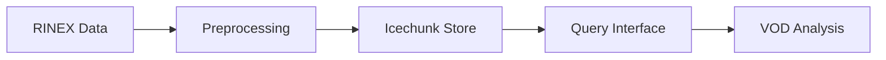

# canvod-store

## Purpose

The `canvod-store` package provides storage management for GNSS vegetation optical depth data using Icechunk, a cloud-native transactional format for multidimensional arrays. It handles dataset storage, preprocessing for storage compatibility, configurable write strategies, and query interfaces.

## Architecture



## Core Components

### Storage Manager

```python
from canvod.store import MyIcechunkStore

store = MyIcechunkStore(store_path, strategy="append")
store.write(dataset)
```

### Preprocessing Pipeline

```python
from canvod.store.preprocessing import IcechunkPreprocessor

preprocessed = IcechunkPreprocessor.prep_aux_ds(raw_dataset)
```

### Reader Interface

```python
from canvod.store import IcechunkDataReader

reader = IcechunkDataReader(store_path)
ds = reader.read(time_range=("2024-01-01", "2024-12-31"))
```

## Data Flow

1. **Ingest**: Raw GNSS data (RINEX, SP3, CLK)
2. **Preprocess**: Convert to standard format (sid dimension, padding)
3. **Store**: Write to Icechunk with compression
4. **Query**: Retrieve by time range or signal selection
5. **Analyze**: VOD calculation and analysis

## Storage Format

Data is stored in Icechunk format with:
- Chunking optimized for time-series access
- Zstd/LZ4 compression
- Built-in version control (git-like semantics for data)
- S3-compatible cloud backends
