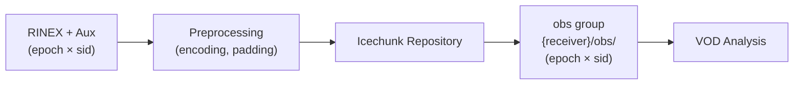

# canvod-store

## Purpose

The `canvod-store` package provides versioned storage management for GNSS vegetation optical depth data using **Icechunk** — a cloud-native transactional format for multidimensional arrays built on Zarr v3.

<div class="grid cards" markdown>

-   :fontawesome-solid-code-branch: &nbsp; **Git-like versioning**

    ---

    Every write produces an Icechunk snapshot with a hash-addressable ID.
    Roll back to any earlier state, audit every append, and reproduce any
    result published from the store.

-   :fontawesome-solid-cloud: &nbsp; **Cloud-native**

    ---

    S3-compatible backends (AWS, MinIO, Cloudflare R2).
    Local filesystem for development. Zero code change to switch.

-   :fontawesome-solid-gauge-high: &nbsp; **Chunked time-series access**

    ---

    Default chunks: `epoch: 34560, sid: -1` — one month of 1 Hz data per chunk.
    Zstd compression, O(1) epoch-range reads.

-   :fontawesome-solid-fingerprint: &nbsp; **Hash deduplication**

    ---

    SHA-256 of each raw RINEX file is stored as `"RINEX File Hash"`.
    Re-submitting the same file is always a no-op — safe to re-run pipelines.

</div>

---

## Architecture



---

## Core Components

=== "Storage Manager"

    ```python
    from canvod.store import MyIcechunkStore

    store = MyIcechunkStore(store_path, strategy="append")
    store.write(dataset)
    ```

=== "Reader Interface"

    ```python
    from canvod.store import IcechunkDataReader

    reader = IcechunkDataReader(store_path)
    ds = reader.read(time_range=("2024-01-01", "2024-12-31"))
    ```

=== "Site Interface"

    ```python
    from canvodpy import Site

    site = Site("Rosalia")
    site.rinex_store.list_groups()          # ["canopy_01", "reference_01"]
    site.rinex_store.get_group_info("canopy_01")
    ```

---

---

## Storage Layout

```
{receiver_name}/
└── obs/                        # Observations (epoch × sid)
    ├── SNR
    ├── Phase
    ├── Pseudorange
    ├── Doppler
    └── ...
```

---

## Data Flow

1. **Ingest** — Raw RINEX data + SP3/CLK ephemerides via `Rnxv3Obs.to_ds()`
2. **Preprocess** — Normalise encodings, pad to global SID, strip fill values
3. **Store observations** — Append to `{group}/obs/` with `"RINEX File Hash"` deduplication
4. **Query** — Retrieve by time range, signal, or group name
5. **Analyse** — VOD calculation using stored observations and grid geometry

---

## Storage Format

| Property | Value |
| -------- | ----- |
| Backend format | Icechunk (Zarr v3) |
| Default chunks | `epoch: 34560`, `sid: -1` |
| Compression | Zstd level 5 |
| Cloud backends | S3, MinIO, R2, local filesystem |
| Versioning | Git-like snapshots, hash-addressable |
| Deduplication | SHA-256 `"RINEX File Hash"` per RINEX file |

[:octicons-arrow-right-24: Icechunk storage details](icechunk.md)
