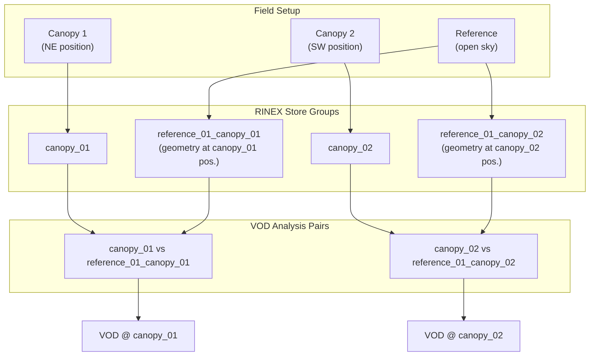

# canvod-vod

## Purpose

The `canvod-vod` package implements vegetation optical depth (VOD) estimation from GNSS signal-to-noise ratio (SNR) data. It provides the core scientific algorithms for the canVODpy analysis pipeline.

---

## Physical Background

!!! abstract "Tau-Omega Radiative Transfer Model"

    canvod-vod implements the **zeroth-order tau-omega** model for GNSS-Transmissometry,
    following Humphrey & Frankenberg (2022).

    A reference receiver in open sky and a canopy receiver beneath vegetation observe
    the same satellite at zenith angle θ. The SNR difference encodes the two-way
    canopy attenuation:

    $$\Delta\text{SNR} = \text{SNR}_\text{canopy} - \text{SNR}_\text{reference}$$

    $$T = 10^{\Delta\text{SNR} / 10} \qquad \text{(linear transmissivity)}$$

    $$\text{VOD} = -\ln(T) \cdot \cos\theta$$

    Assumptions:
    - Single-scattering approximation (no multiple canopy reflections)
    - Plane-parallel canopy layer
    - Attenuation proportional to path length through canopy

---

## Usage

=== "Direct instantiation"

    ```python
    from canvod.vod import TauOmegaZerothOrder

    calculator = TauOmegaZerothOrder(canopy_ds=canopy_ds, sky_ds=sky_ds)
    vod_result = calculator.calculate_vod()
    ```

=== "From aligned datasets"

    ```python
    from canvod.vod import TauOmegaZerothOrder

    vod_result = TauOmegaZerothOrder.from_datasets(
        canopy_ds=canopy_ds,
        sky_ds=sky_ds,
        align=True,  # auto-align epochs before differencing
    )
    ```

=== "From Icechunk store"

    ```python
    from canvod.vod import TauOmegaZerothOrder

    vod_result = TauOmegaZerothOrder.from_icechunkstore(
        icechunk_store_pth="path/to/store",
        canopy_group="canopy_01",
        sky_group="reference_01",
    )
    ```

!!! info "Input requirements"

    Both datasets must contain an `SNR` data variable.
    Both should be augmented with spherical coordinates (θ, φ) from `canvod-auxiliary`
    and assigned to grid cells by `canvod-grids`.

---

## Output

`calculate_vod()` returns an `xr.Dataset` containing:

| Variable | Description |
| -------- | ----------- |
| `VOD` | Vegetation optical depth |
| `phi` | Azimuth angles (from canopy dataset) |
| `theta` | Zenith angles (from canopy dataset) |

---

## Multi-Receiver SCS Expansion

When a single reference receiver serves multiple canopy positions, satellite geometry must be recomputed relative to each canopy location. The `scs_from` configuration in `sites.yaml` drives this expansion.



!!! note "Configuration"

    ```yaml
    # config/sites.yaml
    receivers:
      reference_01:
        type: reference
        scs_from:
          - canopy_01    # recompute geometry at canopy_01 position
          - canopy_02    # recompute geometry at canopy_02 position
    ```

---

## References

Humphrey, V. and Frankenberg, C. (2022). GNSS-transmissometry: A new approach for vegetation optical depth estimation. *Remote Sensing of Environment*.
