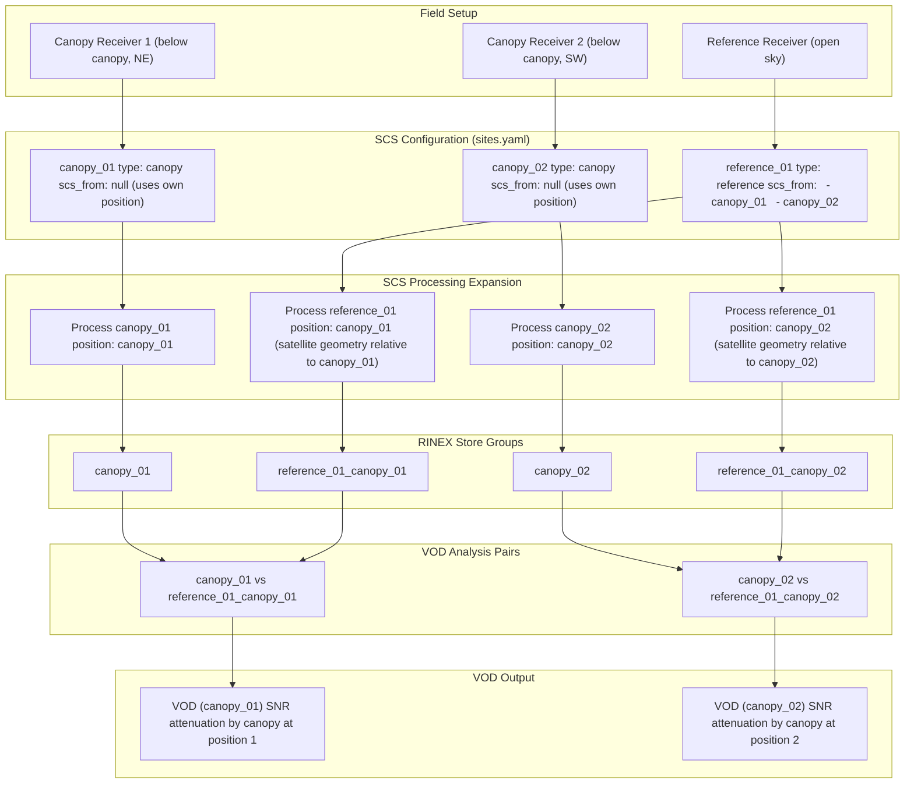

# canvod-vod

## Purpose

The `canvod-vod` package implements vegetation optical depth (VOD) estimation from GNSS signal-to-noise ratio (SNR) data. It provides the core scientific algorithms for the canVODpy analysis pipeline.

## Theoretical Background

The package implements the zeroth-order tau-omega radiative transfer model for GNSS-transmissometry, following Humphrey and Frankenberg (2022). In this model, the attenuation of GNSS signals passing through a vegetation canopy is related to the optical depth (tau) of the canopy layer.

The zeroth-order model assumes:
- Single-scattering approximation (no multiple scattering between canopy elements)
- Plane-parallel canopy layer
- Signal attenuation proportional to the path length through the canopy

## Multi-Receiver SCS Expansion

When a reference receiver serves multiple canopy receivers, its satellite geometry must be recomputed relative to each canopy position. The `scs_from` configuration controls this expansion, creating separate store groups and matched VOD analysis pairs.



## Usage

### Direct instantiation

```python
from canvod.vod import TauOmegaZerothOrder

calculator = TauOmegaZerothOrder(canopy_ds=canopy_ds, sky_ds=sky_ds)
vod_result = calculator.calculate_vod()
```

### From aligned datasets

```python
from canvod.vod import TauOmegaZerothOrder

vod_result = TauOmegaZerothOrder.from_datasets(
    canopy_ds=canopy_ds,
    sky_ds=sky_ds,
    align=True,
)
```

### From Icechunk store

```python
from canvod.vod import TauOmegaZerothOrder

vod_result = TauOmegaZerothOrder.from_icechunkstore(
    icechunk_store_pth="path/to/store",
    canopy_group="canopy_01",
    sky_group="reference_01",
)
```

The calculator requires:

- **Canopy dataset** (`canopy_ds`): RINEX observations from a receiver beneath vegetation
- **Sky dataset** (`sky_ds`): RINEX observations from a nearby open-sky receiver
- Both datasets must contain an `SNR` data variable
- Both datasets should be augmented with spherical coordinates (from canvod-auxiliary) and assigned to grid cells (from canvod-grids)

## Output

`calculate_vod()` returns an `xr.Dataset` containing:

- `VOD` — vegetation optical depth values
- `phi` — azimuth angles (from canopy dataset)
- `theta` — polar angles from zenith (from canopy dataset)

## References

Humphrey, V. and Frankenberg, C. (2022). GNSS-transmissometry: A new approach for vegetation optical depth estimation. *Remote Sensing of Environment*.
