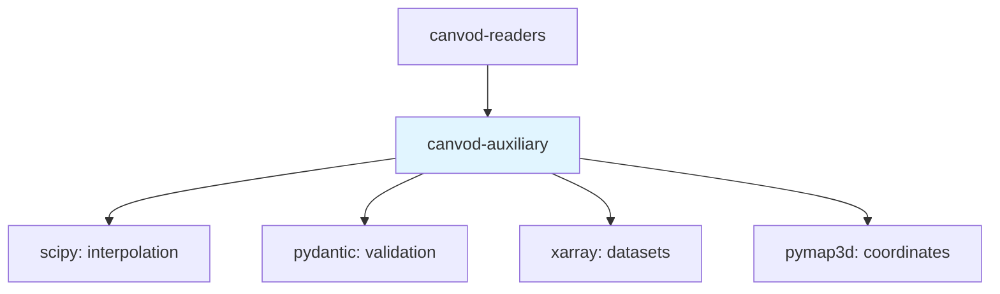

# canvod-auxiliary Documentation

**Auxiliary Data Augmentation for GNSS VOD Analysis**

```{toctree}
:maxdepth: 2
:caption: Contents

overview
preprocessing
interpolation
products
position
api_reference
```

## Quick Links

::::{grid} 2
:gutter: 3

:::{grid-item-card} 🚀 Quick Start
:link: overview
:link-type: doc

Get started with auxiliary data processing in minutes
:::

:::{grid-item-card} 🔄 Preprocessing
:link: preprocessing
:link-type: doc

Understand sv→sid conversion and Icechunk preparation
:::

:::{grid-item-card} 📈 Interpolation
:link: interpolation
:link-type: doc

Learn about Hermite splines and clock correction strategies
:::

:::{grid-item-card} 📦 Product Registry
:link: products
:link-type: doc

Explore 39 validated GNSS products across 17 agencies
:::

::::

## What is canvod-auxiliary?

`canvod-auxiliary` provides comprehensive auxiliary data handling for GNSS vegetation optical depth (VOD) analysis. It manages downloading, parsing, interpolating, and preprocessing SP3 ephemerides and clock corrections to augment RINEX observation data.

### Key Features

- **🛰️ Multi-Agency Support**: 39 validated products from 17 agencies (CODE, GFZ, ESA, NASA CDDIS, etc.)
- **🔄 Smart Preprocessing**: Complete sv→sid conversion matching gnssvodpy exactly
- **📈 Advanced Interpolation**: Hermite cubic splines for ephemerides, piecewise linear for clocks
- **🌐 Position Handling**: ECEF, geodetic, and spherical coordinate transformations
- **💾 Icechunk Ready**: Full 4-step preprocessing for Icechunk storage
- **🔍 Product Registry**: Configuration-based product discovery with Pydantic validation
- **📊 Dataset Matching**: Intelligent temporal alignment between RINEX and auxiliary data

### The canVODpy Ecosystem

```{mermaid}
graph LR
    A[RINEX Files] --> B[canvod-readers]
    C[SP3/CLK Files] --> D[canvod-auxiliary]
    B --> E[Augmented Dataset]
    D --> E
    E --> F[canvod-vod]
    F --> G[canvod-store]

    style D fill:#e1f5ff
```

**canvod-auxiliary** augments RINEX data with satellite positions and clock corrections:

1. **canvod-readers**: Parse RINEX → xarray.Dataset
2. **canvod-auxiliary** (this package): Download/interpolate SP3/CLK → augment with (φ, θ, r)
3. **canvod-vod**: Calculate vegetation optical depth from augmented SNR
4. **canvod-store**: Store data in Icechunk format

## Installation

::::{tab-set}

:::{tab-item} uv (Recommended)
```bash
uv pip install canvod-auxiliary
```
:::

:::{tab-item} pip
```bash
pip install canvod-auxiliary
```
:::

::::

## Quick Example

```python
from canvod.aux import Sp3File, ClkFile, preprocess_aux_for_interpolation
from canvod.aux.interpolation import Sp3InterpolationStrategy, Sp3Config
from datetime import date

# 1. Download/load auxiliary files
sp3 = Sp3File.from_url(date(2024, 1, 1), "CODE", "final")
clk = ClkFile.from_url(date(2024, 1, 1), "CODE", "final")

sp3_data = sp3.to_dataset()  # {'epoch': 96, 'sv': 32}
clk_data = clk.to_dataset()  # {'epoch': 288, 'sv': 32}

# 2. Preprocess: sv → sid (CRITICAL before interpolation!)
sp3_sid = preprocess_aux_for_interpolation(sp3_data)  # {'epoch': 96, 'sid': 384}
clk_sid = preprocess_aux_for_interpolation(clk_data)  # {'epoch': 288, 'sid': 384}

# 3. Interpolate to RINEX epochs
config = Sp3Config(use_velocities=True)
interpolator = Sp3InterpolationStrategy(config=config)

target_epochs = rinex_ds.epoch.values
sp3_interp = interpolator.interpolate(sp3_sid, target_epochs)

# 4. Compute spherical coordinates
from canvod.aux import compute_spherical_coordinates, ECEFPosition

receiver_pos = ECEFPosition.from_ds_metadata(rinex_ds)
r, theta, phi = compute_spherical_coordinates(
    sp3_interp['X'], sp3_interp['Y'], sp3_interp['Z'], receiver_pos
)
```

## Core Concepts

### Satellite Vehicle (sv) vs Signal ID (sid)

**Critical distinction for preprocessing:**

```python
# SP3/CLK files: indexed by satellite vehicle (sv)
sp3_data.dims  # {'epoch': 96, 'sv': 32}
# Example svs: ['G01', 'G02', 'E01', 'R01']

# RINEX files: indexed by Signal ID (sid)
rinex_data.dims  # {'epoch': 2880, 'sid': 384}
# Example sids: ['G01|L1|C', 'G01|L2|W', 'E01|E1|C']

# Preprocessing converts sv → sid (each sv → ~12 sids)
preprocessed = preprocess_aux_for_interpolation(sp3_data)
preprocessed.dims  # {'epoch': 96, 'sid': 384}
```

### Interpolation Strategies

Two scientifically-validated strategies:

**Hermite Cubic Splines (Ephemerides)**:
- Uses satellite positions AND velocities
- C¹ continuous (smooth first derivative)
- Preserves physics of orbital motion
- Accuracy: sub-millimeter for 15-minute SP3 data

**Piecewise Linear (Clock Corrections)**:
- Handles discontinuities at satellite maneuvers
- Jump detection with configurable threshold
- Simple, robust, computationally efficient
- Accuracy: sub-nanosecond for 5-minute CLK data

### Product Registry

39 validated products across 17 agencies:

```python
from canvod.aux import list_available_products, get_product_spec

# List all agencies
agencies = list_agencies()  # ['CODE', 'GFZ', 'ESA', 'JPL', ...]

# Get product specification
spec = get_product_spec("CODE", "final")
print(spec.sp3_url_template)
print(spec.clk_url_template)
print(spec.latency_hours)  # 14 days for final products
```

### Position Transformations

Three coordinate systems supported:

1. **ECEF** (Earth-Centered, Earth-Fixed): Cartesian (X, Y, Z)
2. **Geodetic** (WGS84): Latitude, Longitude, Altitude
3. **Spherical** (Physics convention): (r, θ, φ) relative to receiver

```python
from canvod.aux import ECEFPosition, GeodeticPosition

# From RINEX metadata
ecef = ECEFPosition.from_ds_metadata(rinex_ds)

# Convert to geodetic
lat, lon, alt = ecef.to_geodetic()  # WGS84

# Compute spherical coordinates relative to receiver
r, theta, phi = compute_spherical_coordinates(
    sat_x, sat_y, sat_z, receiver_position
)
```

## Architecture

### Package Structure

```
canvod-auxiliary/
├── core/              # Base classes (AuxFile, FileDownloader)
├── ephemeris/         # SP3 file handler
├── clock/             # CLK file handler
├── products/          # Product registry (39 products)
├── interpolation/     # Hermite splines, piecewise linear
├── preprocessing/     # sv→sid conversion (matches gnssvodpy)
├── position/          # ECEF, geodetic, spherical
├── matching/          # Dataset temporal alignment
└── container/         # GnssData convenience wrapper
```

### Dependencies



**Key dependencies:**
- `canvod-readers>=0.1.0`: GNSS constellation knowledge
- `scipy>=1.15.0`: Hermite spline interpolation
- `pydantic>=2.5.0`: Configuration validation
- `xarray>=2023.12.0`: Dataset operations
- `pymap3d>=3.0.0`: Geodetic transformations

## Comparison with gnssvodpy

canvod-auxiliary **exactly matches** gnssvodpy's preprocessing:

| Feature | gnssvodpy | canvod-auxiliary | Status |
|---------|-----------|------------|--------|
| sv→sid mapping | ✅ | ✅ | Identical |
| Global sid padding | ✅ | ✅ | Identical |
| sid dtype normalization | ✅ | ✅ | Identical |
| _FillValue stripping | ✅ | ✅ | Identical |
| Hermite interpolation | ✅ | ✅ | Identical |
| Clock interpolation | ✅ | ✅ | Identical |
| Product registry | ❌ | ✅ | **New!** |
| Type safety | ⚠️ Partial | ✅ Full | **Improved** |

**Migration from gnssvodpy:**
```python
# Old (gnssvodpy)
from gnssvodpy.icechunk_manager.preprocessing import IcechunkPreprocessor
preprocessed = IcechunkPreprocessor.prep_aux_ds(aux_ds)

# New (canvodpy)
from canvod.aux import prep_aux_ds
preprocessed = prep_aux_ds(aux_ds)  # Identical output!
```

## Performance

Typical processing times (Intel i7, 2024):

| Operation | Input Size | Time | Memory |
|-----------|------------|------|--------|
| Download SP3/CLK | ~5 MB each | ~2s | ~10 MB |
| Parse SP3 | 96 epochs, 32 svs | ~0.5s | ~20 MB |
| Preprocess (sv→sid) | 96 epochs, 32 svs → 384 sids | ~0.2s | ~40 MB |
| Hermite interpolation | 96 → 2880 epochs | ~1.5s | ~60 MB |
| Clock interpolation | 288 → 2880 epochs | ~0.8s | ~50 MB |

**Total pipeline**: ~5 seconds for 24-hour RINEX augmentation.

## Next Steps

::::{grid} 2

:::{grid-item-card} 📖 Learn the Overview
:link: overview
:link-type: doc

Understand the design philosophy and use cases
:::

:::{grid-item-card} 🔄 Preprocessing Guide
:link: preprocessing
:link-type: doc

Deep dive into sv→sid conversion
:::

:::{grid-item-card} 📈 Interpolation Details
:link: interpolation
:link-type: doc

Learn about Hermite splines and clock strategies
:::

:::{grid-item-card} 📦 Product Registry
:link: products
:link-type: doc

Explore all 39 available products
:::

::::
